# ⚡ Moderne CLI-Tools Dokumentation - GitOps/DevOps Edition

**Dokumentation für Dummies** mit anschaulichen Mermaid-Visualisierungen für GitHub!

---

## 📋 Inhaltsverzeichnis

1. [Übersicht der installierten Tools](#übersicht)
2. [Suche & Navigation](#suche--navigation)
3. [Datei-Anzeige & Processing](#datei-anzeige--processing)
4. [System-Monitoring](#system-monitoring)
5. [Terminal-Enhancement](#terminal-enhancement)
6. [Text-Manipulation](#text-manipulation)
7. [Netzwerk & API-Tools](#netzwerk--api-tools)
8. [Workflows & Best Practices](#workflows--best-practices)
9. [Quick Reference Card](#quick-reference-card)

---

## 🎯 Übersicht der installierten Tools {#übersicht}


---

## 🔍 Suche & Navigation {#suche--navigation}

### ripgrep (rg) - Schnellster Grep

**Was macht es?** Extrem schneller Text-Sucher, Ersatz für `grep`.


**Vorteile:**
- ✅ **Schneller** als grep (multithreaded)
- ✅ Ignoriert automatisch `.gitignore`-Dateien
- ✅ Farbige Ausgabe
- ✅ Unterstützt Regex

**Beispiele:**
```bash
# Einfache Suche
rg "error"

# In spezifischem Verzeichnis
rg "kubectl" k8s/

# Dateityp filtern
rg "TODO" --type yaml
rg "function" --type js

# Case-insensitive
rg -i "ERROR"

# Zeilen-Kontext
rg "pattern" -C 3  # 3 Zeilen vor/nach

# Nur Dateinamen
rg -l "pattern"

# Mit Regex
rg "^deployment" --type yaml

# GitOps-Beispiel: Alle Config-Dateien durchsuchen
rg "image:" --type yaml k8s/
rg "secret" --type json
```

**Performance-Vergleich:**


---

### fd (fd-find) - Einfaches Find

**Was macht es?** Benutzerfreundlicheres `find` mit intelligenten Defaults.


**Beispiele:**
```bash
# Dateien finden (einfacher als find)
fd "deployment"

# Nach Erweiterung
fd -e yaml
fd -e json

# In spezifischem Verzeichnis
fd "config" k8s/

# Verzeichnisse finden
fd -t d "terraform"

# Case-insensitive
fd -i "KUBERNETES"

# GitOps-Beispiel: Alle Terraform-Dateien
fd -e tf terraform/

# Alle YAML-Manifests
fd -e yaml k8s/
```

**Vergleich find vs. fd:**

```bash
# Vorher (find)
find . -name "*.yaml" -type f | grep -v node_modules

# Nachher (fd)
fd -e yaml
```

---

### fzf - Fuzzy Finder

**Was macht es?** Interaktives Fuzzy-Searching für fast alles.


**Setup:**
```bash
# Zu ~/.bashrc hinzufügen
# fzf Key Bindings
source /usr/share/fzf/key-bindings.bash
source /usr/share/fzf/completion.bash
```

**Verwendung:**
```bash
# Dateien durchsuchen
fzf

# Mit ripgrep kombinieren
rg "pattern" | fzf

# Git-Commit-History
git log --oneline | fzf

# Prozesse suchen & killen
ps aux | fzf | awk '{print $2}' | xargs kill

# Verzeichnis wechseln (mit zoxide)
cd $(zoxide query -i)

# GitOps-Workflow: Config-Dateien suchen
fd -e yaml | fzf
```

**Wichtigste Shortcuts:**
- `Ctrl+T` = Dateien zum Befehl hinzufügen
- `Ctrl+R` = Command-History suchen
- `Alt+C` = Verzeichnis wechseln
- `Ctrl+J/K` = Navigieren
- `Enter` = Auswählen
- `Esc` = Abbrechen

---

### zoxide - Smart Directory Jumper

**Was macht es?** Merkt sich häufig genutzte Verzeichnisse und springt schnell hin.

```mermaid
graph LR
    A[z terraform] --> B[Springt zu<br/>häufig genutztem<br/>terraform/]
    C[z proj] --> D[Springt zu<br/>project-name/]
    
    style A fill:#2196f3
```



**Setup:**
```bash
# Zu ~/.bashrc hinzufügen
eval "$(zoxide init bash)"

# Oder für zsh
eval "$(zoxide init zsh)"
```

**Verwendung:**
```bash
# Zu Verzeichnis springen (merkt sich Häufigkeit)
z terraform
z k8s

# Nur genau passende Namen
z -e terraform

# Interaktive Auswahl
zi

# Mit fzf kombiniert
z $(zoxide query -i)

# Verzeichnis hinzufügen (ohne zu wechseln)
zoxide add /path/to/dir

# Verzeichnis entfernen
zoxide remove /path/to/dir
```

**GitOps-Workflow:**
```bash
# Häufig genutzte Verzeichnisse schnell erreichen
z k8s          # Zu Kubernetes-Configs
z terraform    # Zu Terraform-Code
z ansible      # Zu Ansible-Playbooks
```

---

## 📄 Datei-Anzeige & Processing {#datei-anzeige--processing}

### bat - Cat mit Syntax-Highlighting

**Was macht es?** Ersetzt `cat` mit Syntax-Highlighting, Git-Integration und mehr.


**Beispiele:**
```bash
# Datei anzeigen
bat deployment.yaml

# Mehrere Dateien
bat *.yaml

# Git-Diff anzeigen
git diff | bat

# Als Pager (z.B. für git log)
git log --oneline | bat

# Highlighting deaktivieren (wie cat)
bat --plain file.txt

# Spezifisches Theme
bat --theme Dracula file.yaml

# GitOps-Beispiel: Configs lesen
bat k8s/*.yaml
bat terraform/*.tf
```

**Alias-Setup:**
```bash
# Zu ~/.bashrc hinzufügen
alias cat='bat --paging=never'
alias catp='bat'  # Mit Paging
```

---

### tree - Verzeichnis-Struktur

**Was macht es?** Zeigt Verzeichnisstruktur als Baum.

```bash
# Verzeichnis anzeigen
tree

# Tiefe begrenzen
tree -L 2

# Nur Verzeichnisse
tree -d

# Versteckte Dateien
tree -a

# GitOps-Beispiel: Projekt-Übersicht
tree k8s/
tree terraform/
```

---

## 📊 System-Monitoring {#system-monitoring}

### btop - Modernes System-Monitoring

**Was macht es?** Visuelles System-Monitoring mit besseren Grafiken als htop.


**Verwendung:**
```bash
# btop starten
btop

# Optionen
btop -t  # Tree-View für Prozesse
```

**Keyboard Shortcuts:**
- `Esc` = Beenden
- `q` = Beenden
- `h` = Help
- `m` = Memory-Details
- `n` = Network-Details

---

### htop - Interaktiver Prozess-Viewer

**Was macht es?** Bessere Alternative zu `top`.

```bash
# htop starten
htop

# Prozess nach Namen filtern
# Drücke F4, dann Namen eingeben

# Prozess killen
# Drücke F9, dann Prozess wählen
```

**Shortcuts:**
- `F4` = Filter
- `F5` = Tree-View
- `F9` = Kill Process
- `F10` = Quit

---

### glances - System-Übersicht

**Was macht es?** Umfassende System-Übersicht mit vielen Metriken.

```bash
# glances starten
glances

# Remote-Monitoring
glances -s  # Server-Modus
glances -c server-ip  # Client-Modus

# Web-Interface
glances -w
```

---

## ⚡ Terminal-Enhancement {#terminal-enhancement}

### starship - Cross-Shell Prompt

**Was macht es?** Schöner, informativer Prompt für alle Shells.

```mermaid
graph LR
    A[Normaler Prompt] --> A1[bernd@machine:~/dir$]
    B[Starship Prompt] --> B1[➜ ~/dir git:main ✗]
    B1 --> B2[Zeigt Git-Status]
    B1 --> B3[Zeigt Python/Node Version]
    B1 --> B4[Farben & Icons]
    
    style B fill:#2196f3
```

**Setup:**
```bash
# Zu ~/.bashrc hinzufügen
eval "$(starship init bash)"
```

**Konfiguration:**
```bash
# Config erstellen
mkdir -p ~/.config
starship preset pure-preset -o ~/.config/starship.toml

# Oder eigene Config
starship config
```

**Features:**
- ✅ Git-Branch & Status
- ✅ Python/Node/Rust Version (wenn in Verzeichnis)
- ✅ Kubernetes Context (wenn gesetzt)
- ✅ Docker (wenn aktiv)
- ✅ Exit-Code bei Fehlern
- ✅ Execution-Zeit für lange Commands

**Beispiel-Prompt:**
```
➜ ~/project git:main ✗ python:3.12 node:20 k8s:prod
```

---

### direnv - Automatisches Environment-Loading

**Was macht es?** Lädt automatisch `.env`-Dateien beim Betreten eines Verzeichnisses.

```mermaid
graph LR
    A[cd project/] --> B[direnv Hook]
    B --> C[.env Datei laden]
    C --> D[Environment Variablen<br/>gesetzt]
    
    E[cd ..] --> F[Environment<br/>rückgängig]
    
    style B fill:#2196f3
```



**Setup:**
```bash
# Zu ~/.bashrc hinzufügen
eval "$(direnv hook bash)"
```

**Verwendung:**
```bash
# .env Datei erstellen
echo "AWS_REGION=eu-central-1" > .envrc
echo "export KUBECONFIG=~/.kube/config-prod" >> .envrc

# Erstes Mal erlauben
direnv allow

# Ab jetzt: Automatisch beim cd
cd project/  # Environment wird geladen
cd ..        # Environment wird entladen
```

**GitOps-Beispiel:**
```bash
# terraform/.envrc
export TF_VAR_aws_region="eu-central-1"
export TF_VAR_environment="production"

# ansible/.envrc
export ANSIBLE_CONFIG="./ansible.cfg"
export ANSIBLE_INVENTORY="./inventory/prod"
```

---

### tmux - Terminal Multiplexer

**Was macht es?** Ermöglicht mehrere Terminal-Sessions in einem Fenster.


**Basics:**
```bash
# Neue Session
tmux

# Session benennen
tmux new -s gitops

# Sessions auflisten
tmux ls

# Session wieder verbinden
tmux attach -t gitops
```

**Wichtigste Shortcuts (Prefix: Ctrl+B):**
- `Prefix + c` = Neues Window
- `Prefix + n` = Nächstes Window
- `Prefix + %` = Vertical Split
- `Prefix + "` = Horizontal Split
- `Prefix + →/←` = Zwischen Panes wechseln
- `Prefix + d` = Session detachen

**GitOps-Workflow:**
```bash
tmux new -s gitops

# Window 1: Kubernetes
k9s

# Window 2: Terraform
cd terraform
terraform plan

# Window 3: Logs
kubectl logs -f my-pod
```

---

## ✏️ Text-Manipulation {#text-manipulation}

### jq - JSON Processor

**Was macht es?** Mächtiger JSON-Prozessor (bereits installiert).

```bash
# JSON formatieren
echo '{"key":"value"}' | jq

# Feld extrahieren
echo '{"name":"test"}' | jq '.name'

# Array durchlaufen
echo '{"items":[1,2,3]}' | jq '.items[]'

# GitOps-Beispiel: Kubernetes Configs
kubectl get deployment -o json | jq '.items[].spec.template.spec.containers[].image'
```

---

### yq - YAML Processor

**Was macht es?** YAML-Prozessor (wie jq für YAML) - bereits installiert v4.48.1.

```bash
# YAML lesen
yq '.spec.replicas' deployment.yaml

# YAML ändern
yq '.spec.replicas = 3' deployment.yaml

# GitOps-Beispiel
yq '.spec.template.spec.containers[0].image' k8s/deployment.yaml
yq '.spec.replicas = 5' -i k8s/deployment.yaml
```

---

### htmlq - HTML-Parser

**Was macht es?** Extrahiert Daten aus HTML (wie jq für HTML).

```bash
# HTML parsen
curl https://example.com | htmlq 'title'

# Alle Links
curl https://example.com | htmlq 'a' --attribute href

# CSS-Selektoren
curl https://example.com | htmlq '.content p'
```

---

### fx - JSON-Viewer

**Was macht es?** Interaktiver JSON-Viewer im Terminal.

```bash
# JSON interaktiv durchsuchen
echo '{"key":"value"}' | fx

# Datei öffnen
fx data.json

# Mit jq kombinieren
kubectl get pods -o json | jq '.items[]' | fx
```

---

## 🌐 Netzwerk & API-Tools {#netzwerk--api-tools}

### httpie - Menschlicher API-Client

**Was macht es?** Benutzerfreundlicheres curl für API-Tests.


**Beispiele:**
```bash
# GET Request
http https://api.github.com/repos/kubernetes/kubernetes

# POST Request
http POST api.example.com/users name=test email=test@example.com

# Mit Headers
http GET api.example.com/users Authorization:"Bearer token123"

# JSON Body
http POST api.example.com/data <<< '{"key":"value"}'

# Response speichern
http GET api.example.com/data > response.json

# GitOps-Beispiel: Kubernetes API
http https://kubernetes.default.svc/api/v1/namespaces \
  Authorization:"Bearer $(kubectl get secret -n kube-system -o jsonpath='{.items[0].data.token}' | base64 -d)"
```

**Vergleich curl vs. httpie:**
```bash
# curl
curl -X POST https://api.example.com/users \
  -H "Content-Type: application/json" \
  -H "Authorization: Bearer token" \
  -d '{"name":"test"}'

# httpie
http POST api.example.com/users name=test Authorization:"Bearer token"
```

---

### mtr - Network-Diagnostik

**Was macht es?** Kombination aus `ping` und `traceroute`.

```bash
# Zu Server testen
mtr google.com

# Report-Modus (nicht-interaktiv)
mtr --report --report-cycles 10 google.com

# GitOps-Beispiel: Cluster-Connectivity
mtr kubernetes.default.svc.cluster.local
```

---

### rsync - File Synchronisation

**Was macht es?** Effiziente Datei-Synchronisation (bereits installiert).

```bash
# Dateien synchronisieren
rsync -av source/ dest/

# Remote synchronisieren
rsync -av local/ user@server:/remote/

# Exclude-Patterns
rsync -av --exclude '*.log' source/ dest/

# GitOps-Beispiel: Configs deployen
rsync -av k8s/ user@k8s-server:/etc/k8s/
```

---

## 🔄 Workflows & Best Practices {#workflows--best-practices}

### GitOps CLI-Workflow

```mermaid
graph LR
    A[Code Änderung] --> B[ripgrep<br/>Suche Patterns]
    B --> C[fd<br/>Finde Dateien]
    C --> D[bat<br/>Zeige Config]
    D --> E[yq/jq<br/>Manipuliere]
    E --> F[zoxide<br/>Navigiere]
    
    style A fill:#2196f3
    style E fill:#4caf50
```



**Praktischer Workflow:**
```bash
# 1. Suche nach Problem
rg "image:" --type yaml k8s/

# 2. Datei schnell öffnen
fd "deployment" | fzf | xargs bat

# 3. Config ändern
yq '.spec.replicas = 5' -i k8s/deployment.yaml

# 4. Diff anschauen
git diff | bat

# 5. Committen
git add . && git commit -m "feat: scale deployment"
```

---

### Datei-Suche Workflow


---

## 📚 Quick Reference Card {#quick-reference-card}

### Wichtigste Commands

| Tool | Command | Zweck |
|------|---------|-------|
| **rg** | `rg pattern` | Text suchen |
| **fd** | `fd pattern` | Dateien finden |
| **fzf** | `fzf` | Interaktive Suche |
| **zoxide** | `z dirname` | Verzeichnis wechseln |
| **bat** | `bat file` | Datei anzeigen |
| **starship** | `starship init bash` | Prompt-Setup |
| **direnv** | `direnv allow` | Env-Loading |
| **tmux** | `tmux new -s name` | Session erstellen |
| **httpie** | `http GET url` | API-Request |
| **jq** | `jq '.field'` | JSON verarbeiten |
| **yq** | `yq '.field'` | YAML verarbeiten |

### Aliases (empfohlen für ~/.bashrc)

```bash
# fd -> fd (Ubuntu nennt es fdfind)
alias fd='fdfind'

# bat als cat
alias cat='bat --paging=never'

# zoxide
eval "$(zoxide init bash)"

# starship
eval "$(starship init bash)"

# direnv
eval "$(direnv hook bash)"
```

---

## ✅ Installation Status

| Tool | Version | Status |
|------|---------|--------|
| ripgrep (rg) | v14.1.0 | ✅ Installiert |
| fd-find | v9.0.0 | ✅ Installiert |
| fzf | v0.44.1 | ✅ Installiert |
| zoxide | v0.9.3 | ✅ Installiert |
| bat | v0.24.0 | ✅ Installiert |
| tree | v2.1.1 | ✅ Installiert |
| btop | v1.3.0 | ✅ Installiert |
| htop | v3.3.0 | ✅ Installiert |
| glances | v3.4.0.3 | ✅ Installiert |
| starship | v1.24.0 | ✅ Installiert |
| direnv | v2.32.1 | ✅ Installiert |
| tmux | latest | ✅ Installiert |
| jq | v1.7 | ✅ Installiert |
| yq | v4.48.1 | ✅ Installiert |
| htmlq | v0.4.0 | ✅ Installiert |
| fx | v30.0.0 | ✅ Installiert |
| httpie | v3.2.2 | ✅ Installiert |
| mtr | v0.95 | ✅ Installiert |
| rsync | v3.2.7 | ✅ Installiert |
| neovim | v0.9.5 | ✅ Installiert |
| eza | v0.23.4 | ✅ Installiert (QA-Runde) |
| sd | v1.0.0 | ✅ Installiert (QA-Runde) |
| choose | v1.3.7 | ✅ Installiert (QA-Runde) |
| dust | v1.2.3 | ✅ Installiert (QA-Runde) |

**Optional/Nicht installiert:**
- **dog**: Nicht installierbar (benötigt libssl.so.1.1, Ubuntu 24.04 hat libssl.so.3). Alternative: `dig` verwenden
- **broot**: Nicht installiert (Release-URL-Struktur problematisch). Alternative: `tree`, `ncdu` oder normale Navigation

---

## 🎯 Setup-Empfehlungen

### ~/.bashrc Konfiguration

```bash
# Moderne CLI-Tools Setup
eval "$(zoxide init bash)"
eval "$(starship init bash)"
eval "$(direnv hook bash)"

# Aliases
alias fd='fdfind'
alias cat='bat --paging=never'
alias catp='bat'

# fzf Key Bindings
source /usr/share/fzf/key-bindings.bash
source /usr/share/fzf/completion.bash
```

**Nach Änderungen:**
```bash
source ~/.bashrc
```

---

**Viel Erfolg mit deinen modernen CLI-Tools! ⚡**

*Diese Dokumentation wurde automatisch generiert für WSL2 Ubuntu 24.04*

