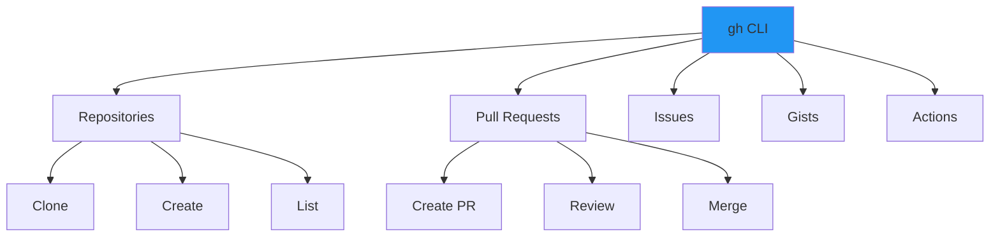

# 🔀 Git Tools Dokumentation - GitOps/DevOps Edition

**Dokumentation für Dummies** mit anschaulichen Mermaid-Visualisierungen für GitHub!

---

## 📋 Inhaltsverzeichnis

1. [Übersicht der installierten Tools](#übersicht)
2. [Git Basics - Refresher](#git-basics)
3. [Git-Diff-Verbesserungen](#git-diff-verbesserungen)
4. [Terminal UIs für Git](#terminal-uis-für-git)
5. [GitHub/GitLab Integration](#githubgitlab-integration)
6. [Security & Secrets Management](#security--secrets-management)
7. [Git Workflows (Git Flow)](#git-workflows)
8. [Pre-Commit Hooks](#pre-commit-hooks)
9. [GitOps Best Practices](#gitops-best-practices)
10. [Quick Reference Card](#quick-reference-card)

---

## 🎯 Übersicht der installierten Tools {#übersicht}


---

## 🔧 Git Basics - Refresher {#git-basics}

### Git Workflow Grundlagen


**Basis-Befehle:**
```bash
# Status prüfen
git status

# Änderungen hinzufügen
git add file.yaml
git add .  # Alle Änderungen

# Committen
git commit -m "feat: update deployment config"

# Pushen
git push origin main

# Pullen (aktuelle Änderungen holen)
git pull origin main

# Branch erstellen & wechseln
git checkout -b feature/new-feature
git checkout main

# Branches mergen
git merge feature/new-feature
```

---

## 📊 Git-Diff-Verbesserungen {#git-diff-verbesserungen}

### git-delta - Syntax-Highlighted Diffs

**Was macht es?** Macht `git diff` schön lesbar mit Syntax-Highlighting, Side-by-Side-View und besserer Formatierung.

```mermaid
graph LR
    A[git diff] --> B[Git Delta]
    B --> C[Syntax Highlighting]
    B --> D[Side-by-Side View]
    B --> E[Color Coding]
    
    F[Vorher] --> G[Schlecht lesbar]
    H[Nachher] --> I[Schön formatiert]
    
    style B fill:#2196f3
    style I fill:#4caf50
    style G fill:#ff9800
```



**Setup:**
```bash
# Git Delta in Git Config konfigurieren
git config --global core.pager delta
git config --global interactive.diffFilter 'delta --color-only'
git config --global delta.navigate true
git config --global merge.conflictstyle diff3
git config --global diff.colorMoved default
```

**Konfiguration (empfohlen):**
```bash
# Zu ~/.gitconfig hinzufügen (wird automatisch erstellt)
[delta]
    side-by-side = true
    line-numbers = true
    syntax-theme = Dracula  # Oder: GitHub, Monokai, etc.
    navigate = true
```

**Beispiele:**
```bash
# Normale Diff-Ansicht (mit Delta)
git diff

# Diff einer spezifischen Datei
git diff k8s/deployment.yaml

# Diff zwischen Branches
git diff main..feature-branch

# Diff der letzten 3 Commits
git diff HEAD~3
```

**Vorteile:**
- ✅ Syntax-Highlighting für YAML, JSON, Go, etc.
- ✅ Side-by-Side-Ansicht
- ✅ Bessere Farben für gelöschte/hinzugefügte Zeilen
- ✅ Navigationsmodus mit `n` (next) / `p` (previous)

---

### difftastic - Strukturierter Diff für Code

**Was macht es?** Zeigt Diffs basierend auf Code-Struktur, nicht nur Zeilen für Zeilen.


**Beispiele:**
```bash
# Zwei Dateien vergleichen
difftastic file1.yaml file2.yaml

# Git Diff mit difftastic
difftastic HEAD HEAD~1

# Als Git Diff-Tool verwenden
git config --global diff.tool difftastic
git difftool
```

**Wann nutzen?**
- YAML/JSON Configs vergleichen
- Code-Strukturen verstehen
- Refactoring-Änderungen nachvollziehen

---

### meld - GUI Diff/Merge Tool

**Was macht es?** Grafisches Tool zum Vergleichen und Mergen von Dateien.


**Setup:**
```bash
# Als Git Diff-Tool konfigurieren
git config --global diff.tool meld
git config --global merge.tool meld
git config --global difftool.prompt false
```

**Verwendung:**
```bash
# Datei vergleichen (GUI öffnet sich)
git difftool

# Merge-Konflikte lösen (GUI)
git mergetool

# Direkt meld starten
meld file1.yaml file2.yaml

# Drei-Wege-Merge
meld base.yaml local.yaml remote.yaml
```

**Vorteile:**
- ✅ Visuelles Highlighting
- ✅ Einfaches Mergen per Klick
- ✅ Unterstützt 3-Wege-Merges
- ✅ Für Nicht-Terminal-Nutzer ideal

---

### vimdiff - Terminal Diff Tool

**Was macht es?** Diff-Tool in Vim für Terminal-Liebhaber.

```bash
# Als Git Diff-Tool
git config --global diff.tool vimdiff
git difftool

# Direkt verwenden
vimdiff file1.yaml file2.yaml
```

**Vimdiff Commands:**
- `]c` = Nächster Unterschied
- `[c` = Vorheriger Unterschied
- `do` = Änderung von rechts nach links kopieren
- `dp` = Änderung von links nach rechts kopieren
- `:diffupdate` = Diff aktualisieren

---

## 🖥️ Terminal UIs für Git {#terminal-uis-für-git}

### tig - Terminal Git Browser

**Was macht es?** Interaktive Terminal-UI zum Browsen durch Git-History und Repository-Struktur.

```mermaid
stateDiagram-v2
    [*] --> tig_start: tig starten
    tig_start --> Main_View: Hauptansicht
    Main_View --> Commit_Detail: Enter auf Commit
    Main_View --> Branch_View: :branches
    Main_View --> File_View: :files
    Main_View --> Blame_View: :blame
    
    Commit_Detail --> File_Changes: Enter auf Datei
    File_Changes --> Diff_View: Enter auf Änderung
    
    Main_View --> Search: /
    Search --> Filtered_View: Suche eingeben
```



**Basics:**
```bash
# tig starten
tig

# In spezifischem Verzeichnis
tig /path/to/repo

# Dafür bestimmter Branch
tig branch-name

# Blame (wer hat was geändert)
tig blame file.yaml
```

**Wichtigste Shortcuts:**
- `Enter` = Detailansicht öffnen
- `/` = Suche
- `:branches` = Branch-Übersicht
- `:files` = Datei-Übersicht
- `:stash` = Stash-Liste
- `:refs` = Alle Referenzen
- `Ctrl+L` = Refresh
- `q` = Zurück/Beenden

**Views:**


**Beispiel-Workflow:**
```bash
tig                    # tig starten
:files                 # Dateien anschauen
Enter auf file.yaml    # Datei-Details
/searchterm            # Nach Begriff suchen
Enter auf Commit       # Commit-Details
Shift+T                # Commit cherry-picken
```

---

## 🔗 GitHub/GitLab Integration {#githubgitlab-integration}

### gh - GitHub CLI

**Was macht es?** Verwaltung von GitHub-Issues, PRs, Repositories direkt aus dem Terminal.



**Setup:**
```bash
# Login zu GitHub
gh auth login

# Login mit Token (für CI/CD)
gh auth login --with-token < my_token.txt

# Status prüfen
gh auth status
```

**Repository-Management:**
```bash
# Repository klonen
gh repo clone owner/repo

# Repository erstellen
gh repo create my-repo --public

# Repository-Info
gh repo view owner/repo

# Repository-Liste
gh repo list

# Repository forken
gh repo fork owner/repo
```

**Pull Requests:**


**PR-Befehle:**
```bash
# PR erstellen
gh pr create --title "feat: new feature" --body "Description"

# PR-Liste
gh pr list

# PR anzeigen
gh pr view 123

# PR öffnen im Browser
gh pr view --web

# PR-Checks prüfen
gh pr checks

# PR mergen
gh pr merge 123 --squash
gh pr merge 123 --merge
gh pr merge 123 --rebase

# PR reviewen
gh pr review 123 --approve
gh pr review 123 --request-changes --comment "Fix X"
```

**Issues:**
```bash
# Issue erstellen
gh issue create --title "Bug: ..." --body "Description"

# Issue-Liste
gh issue list

# Issue anzeigen
gh issue view 42

# Issue schließen
gh issue close 42
```

**GitOps-Workflow mit gh:**
```bash
# Feature-Branch erstellen
git checkout -b feature/update-k8s-config

# Änderungen machen
vim k8s/deployment.yaml
git add k8s/deployment.yaml
git commit -m "feat: update deployment"

# Push & PR erstellen
git push origin feature/update-k8s-config
gh pr create --title "Update K8s Config" --body "Updates deployment"
```

---

## 🔒 Security & Secrets Management {#security--secrets-management}

### git-secrets - Verhindert Secret-Commits

**Was macht es?** Scannt Commits auf Passwörter, API-Keys und andere Secrets.

```mermaid
graph TB
    A[git commit] --> B{git-secrets Hook}
    B --> C{Secret<br/>gefunden?}
    C -->|Ja| D[❌ Commit<br/>wird blockiert]
    C -->|Nein| E[✅ Commit<br/>erlaubt]
    
    F[Patterns] --> B
    F --> F1[API Keys]
    F --> F2[Passwords]
    F --> F3[Tokens]
    
    style D fill:#f44336
    style E fill:#4caf50
```



**Setup:**
```bash
# In Repository installieren
cd /path/to/repo
git secrets --install

# AWS-Patterns hinzufügen (wenn AWS genutzt wird)
git secrets --register-aws

# Custom Pattern hinzufügen
git secrets --add 'AKIA[0-9A-Z]{16}'

# Erlaubtes Pattern (Exception)
git secrets --add --allowed 'AKIAEXAMPLE123'
```

**Verwendung:**
```bash
# Dateien scannen
git secrets --scan

# Gesamte History scannen
git secrets --scan-history

# Liste der Patterns
git secrets --list

# Mit git-diff kombinieren
git diff | git secrets --scan
```

**Beispiel-Konfiguration für GitOps:**
```bash
# Typische Secrets die wir blockieren wollen:
git secrets --add 'password\s*=\s*.+'
git secrets --add 'api_key\s*=\s*.+'
git secrets --add 'secret\s*=\s*.+'
git secrets --add 'token\s*=\s*.+'
git secrets --add 'AKIA[0-9A-Z]{16}'  # AWS Access Key
```

**GitOps-Best-Practice:**
```bash
# Vor jedem Commit automatisch prüfen
# (wird automatisch durch --install eingerichtet)

# In CI/CD Pipeline
git secrets --scan-history || exit 1
```

---

## 🌊 Git Workflows (Git Flow) {#git-workflows}

### git-flow - Branching-Strategie Tool

**Was macht es?** Automatisiert Git Flow Workflow (Feature/Branch-Strategie).


**Init:**
```bash
# Git Flow initialisieren
git flow init

# Fragen:
# - Branch name for production: [main]
# - Branch name for "next release": [develop]
# - Feature branches: [feature/]
# - Release branches: [release/]
# - Hotfix branches: [hotfix/]
```

**Feature-Branches:**
```bash
# Feature starten
git flow feature start my-feature

# Feature pushen
git flow feature publish my-feature

# Feature fertigstellen (mergt nach develop)
git flow feature finish my-feature

# Feature lokal löschen
git flow feature delete my-feature
```

**Release-Branches:**
```bash
# Release starten
git flow release start 1.0.0

# Release fertigstellen (mergt nach main & develop)
git flow release finish 1.0.0

# Release pushen
git push origin main --tags
git push origin develop
```

**Hotfixes:**
```bash
# Hotfix starten (von main)
git flow hotfix start 1.0.1

# Hotfix fertigstellen (mergt nach main & develop)
git flow hotfix finish 1.0.1
```

**GitOps-Workflow mit Git Flow:**


**Vorteile für GitOps:**
- ✅ Klare Branch-Strategie
- ✅ Automatisches Tagging
- ✅ Konsistente Releases
- ✅ Hotfixes einfach zu managen

---

## ✅ Pre-Commit Hooks {#pre-commit-hooks}

### pre-commit - Git-Hooks Framework

**Was macht es?** Führt automatische Checks vor jedem Commit aus (Linting, Formatting, Tests).

```mermaid
graph LR
    A[git commit] --> B[pre-commit Hook]
    B --> C{Checks OK?}
    C -->|Ja| D[✅ Commit]
    C -->|Nein| E[❌ Blockiert]
    
    B --> F[YAML Lint]
    B --> G[kubeval]
    B --> H[Secret Scan]
    B --> I[Format Check]
    
    style D fill:#4caf50
    style E fill:#f44336
```



**Setup:**
```bash
# PATH erweitern (falls pre-commit in ~/.local/bin)
export PATH="$HOME/.local/bin:$PATH"

# In Repository installieren
cd /path/to/repo
pre-commit install

# Pre-commit manuell ausführen
pre-commit run --all-files
```

**`.pre-commit-config.yaml` Beispiel für GitOps:**
```yaml
repos:
  # General file checks
  - repo: https://github.com/pre-commit/pre-commit-hooks
    rev: v4.5.0
    hooks:
      - id: trailing-whitespace
      - id: end-of-file-fixer
      - id: check-yaml
      - id: check-json
      - id: check-added-large-files
      - id: detect-private-key

  # YAML linting
  - repo: https://github.com/adrienverge/yamllint
    rev: v1.33.0
    hooks:
      - id: yamllint
        args: [-d, '{extends: default, rules: {line-length: {max: 120}}}']

  # Kubernetes validation
  - repo: https://github.com/instrumenta/kubeval
    rev: master
    hooks:
      - id: kubeval
        args: [--strict]

  # Secret detection
  - repo: https://github.com/Yelp/detect-secrets
    rev: v1.4.0
    hooks:
      - id: detect-secrets
        args: ['--baseline', '.secrets.baseline']
```

**Verwendung:**
```bash
# Hooks für alle Dateien ausführen
pre-commit run --all-files

# Spezifischen Hook ausführen
pre-commit run yamllint

# Hooks manuell testen
pre-commit run

# Hooks deinstallieren
pre-commit uninstall
```

**GitOps-Workflow:**

```mermaid
sequenceDiagram
    participant Dev as Developer
    participant Git as Git
    participant PreCommit as pre-commit
    participant Checks as Validators
    
    Dev->>Git: git commit
    Git->>PreCommit: Hook triggered
    PreCommit->>Checks: YAML Lint
    PreCommit->>Checks: kubeval
    PreCommit->>Checks: Secret Scan
    Checks-->>PreCommit: Results
    alt All OK
        PreCommit->>Git: ✅ Commit allowed
    else Errors
        PreCommit->>Git: ❌ Commit blocked
        PreCommit->>Dev: Show errors
    end
```


---

## 🎯 GitOps Best Practices {#gitops-best-practices}

### GitOps-Workflow Komplett


### Branch-Strategie für GitOps


### Commit-Message Best Practices

**Conventional Commits für GitOps:**
```bash
feat: add new deployment config
fix: correct resource limits
chore: update k8s manifests
docs: update README
refactor: reorganize k8s directory
test: add integration tests
```

**Beispiele:**
```bash
git commit -m "feat(k8s): add redis deployment"
git commit -m "fix(helm): correct values.yaml typo"
git commit -m "chore: update kubectl to v1.34.1"
```

### Config-Export Workflow

```mermaid
sequenceDiagram
    participant K8s as Kubernetes
    participant KubeCtl as kubectl
    participant Neat as kubectl-neat
    participant Git as Git
    
    K8s->>KubeCtl: kubectl get -o yaml
    KubeCtl->>Neat: kubectl neat
    Neat->>Git: Clean YAML
    Git->>Git: Commit
    
    Note over Neat,Git: Saubere Configs für GitOps!
```



**Praktischer Command:**
```bash
# Deployment aus Cluster exportieren & aufräumen
kubectl get deployment my-app -o yaml | \
  kubectl neat > k8s/deployments/my-app.yaml

# Commit mit Delta-Diff prüfen
git diff k8s/deployments/my-app.yaml

# Committen
git add k8s/deployments/my-app.yaml
git commit -m "chore: sync deployment from cluster"
```

---

## 📚 Quick Reference Card {#quick-reference-card}

### Wichtigste Commands

| Tool | Command | Zweck |
|------|---------|-------|
| **git** | `git status` | Status prüfen |
| **git** | `git diff` | Änderungen anzeigen |
| **git-delta** | `git diff` (auto) | Schöne Diffs |
| **tig** | `tig` | Terminal Git Browser |
| **gh** | `gh pr create` | PR erstellen |
| **gh** | `gh pr list` | PRs auflisten |
| **gh** | `gh issue create` | Issue erstellen |
| **git-secrets** | `git secrets --scan` | Secrets scannen |
| **git-flow** | `git flow feature start` | Feature starten |
| **pre-commit** | `pre-commit run` | Hooks ausführen |
| **difftastic** | `difftastic file1 file2` | Dateien vergleichen |
| **meld** | `meld file1 file2` | GUI Diff |

### Keyboard Shortcuts (tig)

| Shortcut | Aktion |
|----------|--------|
| `Enter` | Detailansicht |
| `/` | Suche |
| `:branches` | Branches |
| `:files` | Dateien |
| `:stash` | Stash-Liste |
| `Ctrl+L` | Refresh |
| `q` | Zurück |

### Git-Delta Shortcuts

| Shortcut | Aktion |
|----------|--------|
| `n` / `↓` | Nächster Unterschied |
| `p` / `↑` | Vorheriger Unterschied |
| `s` | Side-by-Side toggle |
| `w` | Wrap toggle |

---

## 🎓 GitOps Lernpfad


---

## 🔗 Weitere Ressourcen

- **Git Documentation**: https://git-scm.com/doc
- **Git Delta**: https://github.com/dandavison/delta
- **tig**: https://github.com/jonas/tig
- **GitHub CLI**: https://cli.github.com/
- **git-flow**: https://github.com/nvie/gitflow
- **pre-commit**: https://pre-commit.com/

---

## ✅ Installation Status

| Tool | Version | Status |
|------|---------|--------|
| git | v2.43.0 | ✅ Installiert |
| git-lfs | v3.4.1 | ✅ Installiert |
| git-delta | v0.18.1 | ✅ Installiert |
| tig | v2.5.8 | ✅ Installiert |
| git-flow | v1.12.3 | ✅ Installiert |
| gh | v2.52.0 | ✅ Installiert |
| git-secrets | latest | ✅ Installiert |
| difftastic | v0.65.0 | ✅ Installiert |
| meld | v3.22.2 | ✅ Installiert |
| vimdiff | v9.1 | ✅ Installiert |
| gitleaks | v8.22.0 | ✅ Installiert (QA-Runde) |
| pre-commit | v4.3.0 | ✅ Installiert (~/.local/bin) |

**Optional/Troubleshooting:**
- **lazygit**: Installation versucht, aber Release-URLs 404. Alternative: `tig` (bereits installiert) oder via Go: `go install github.com/jesseduffield/lazygit@latest`
- **glab**: Installation versucht, aber GitLab Release-URLs instabil. Workaround: GitLab Releases-Seite manuell nutzen oder `gh` für GitLab-kompatible Workflows verwenden

**Hinweis:** `pre-commit` ist in `~/.local/bin` installiert. Füge folgendes zu deiner `~/.bashrc` oder `~/.zshrc` hinzu:

```bash
export PATH="$HOME/.local/bin:$PATH"
```

---

**Viel Erfolg mit deinem GitOps/DevOps Git-Setup! 🔀**

*Diese Dokumentation wurde automatisch generiert für WSL2 Ubuntu 24.04*

