# ☁️ Infrastructure-as-Code Tools Dokumentation - GitOps/DevOps Edition

**Dokumentation für Dummies** mit anschaulichen Mermaid-Visualisierungen für GitHub!

---

## 📋 Inhaltsverzeichnis

1. [Übersicht der installierten Tools](#übersicht)
2. [Terraform - Der IaC Standard](#terraform)
3. [Terraform Helper Tools](#terraform-helper-tools)
4. [Ansible - Configuration Management](#ansible)
5. [Cloud CLIs](#cloud-clis)
6. [Packer & Image Building](#packer)
7. [GitOps Workflows mit IaC](#gitops-workflows)
8. [Best Practices](#best-practices)
9. [Quick Reference Card](#quick-reference-card)

---

## 🎯 Übersicht der installierten Tools {#übersicht}

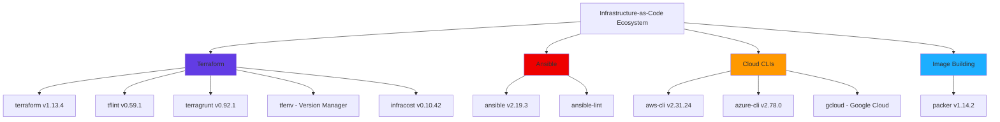

---

## 🏗️ Terraform - Der IaC Standard {#terraform}

### Was ist Terraform?

**Terraform** ist das meistgenutzte Infrastructure-as-Code Tool. Es beschreibt Cloud-Infrastruktur deklarativ und verwaltet sie automatisch.

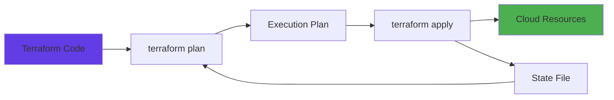

### Terraform Basics

**Workflow:**

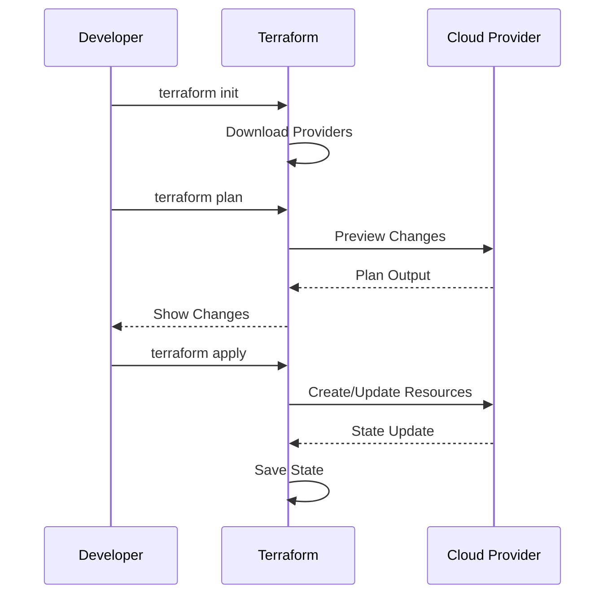

**Basis-Befehle:**
```bash
# Terraform initialisieren (Provider herunterladen)
terraform init

# Plan erstellen (was würde geändert werden?)
terraform plan

# Änderungen anwenden
terraform apply

# Infrastruktur zerstören
terraform destroy

# State prüfen
terraform state list
terraform state show resource.name

# Format Code
terraform fmt

# Code validieren
terraform validate
```

### Terraform File-Struktur

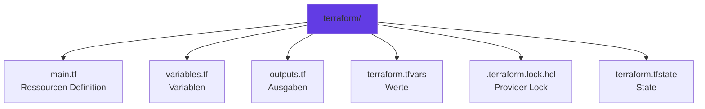

**Beispiel `main.tf`:**
```hcl
terraform {
  required_version = ">= 1.0"
  required_providers {
    aws = {
      source  = "hashicorp/aws"
      version = "~> 5.0"
    }
  }
}

provider "aws" {
  region = var.aws_region
}

resource "aws_s3_bucket" "my_bucket" {
  bucket = var.bucket_name
  
  tags = {
    Environment = "production"
    ManagedBy   = "terraform"
  }
}
```

**`variables.tf`:**
```hcl
variable "aws_region" {
  description = "AWS Region"
  type        = string
  default     = "us-east-1"
}

variable "bucket_name" {
  description = "S3 Bucket Name"
  type        = string
}
```

**`outputs.tf`:**
```hcl
output "bucket_id" {
  description = "S3 Bucket ID"
  value       = aws_s3_bucket.my_bucket.id
}
```

**`terraform.tfvars`:**
```hcl
aws_region  = "eu-central-1"
bucket_name = "my-gitops-bucket"
```

---

## 🔍 Terraform Helper Tools {#terraform-helper-tools}

### tflint - Terraform Linter

**Was macht es?** Findet Fehler, Best-Practice-Verstöße und potentielle Probleme in Terraform-Code.

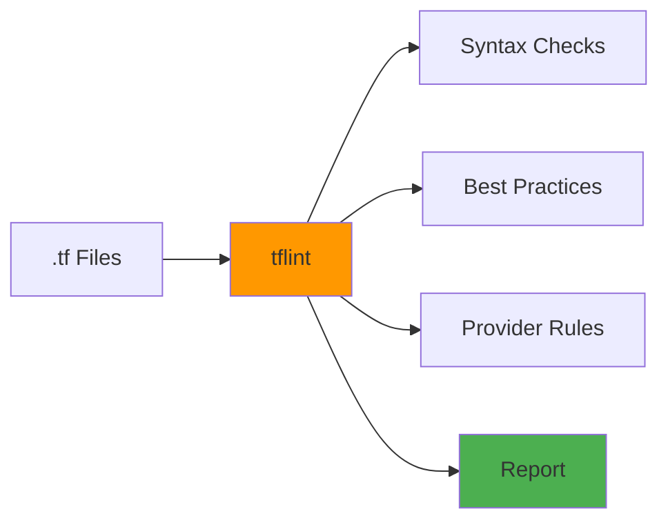

**Verwendung:**
```bash
# Lint aktuelles Verzeichnis
tflint

# Lint mit Config-Datei
tflint --config .tflint.hcl

# Recursive (alle Unterverzeichnisse)
tflint --recursive

# Auto-fix wo möglich
tflint --fix
```

**`.tflint.hcl` Beispiel:**
```hcl
config {
  module = true
  force  = false
}

plugin "aws" {
  enabled = true
  version = "0.28.0"
  source  = "github.com/terraform-linters/tflint-ruleset-aws"
}

rule "aws_resource_missing_tags" {
  enabled = true
}
```

---

### terragrunt - DRY für Terraform

**Was macht es?** Reduziert Code-Duplikation bei Multi-Environment-Setups (Dev/Staging/Prod).

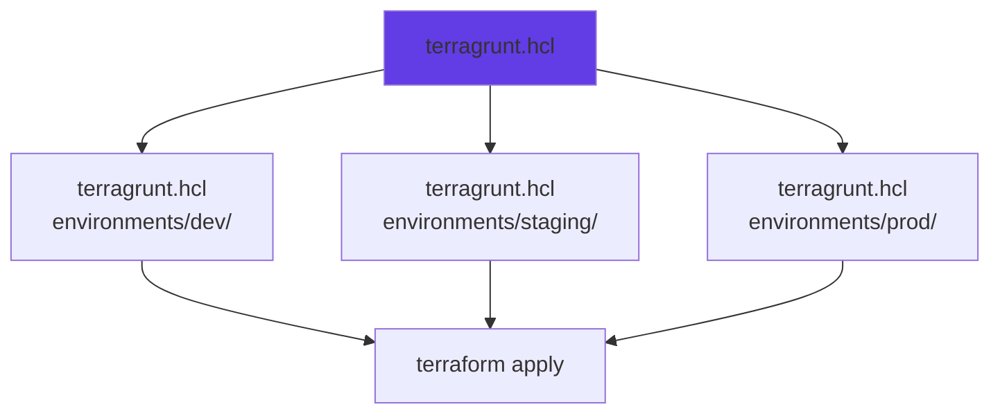

**Struktur:**
```
infrastructure/
├── terragrunt.hcl          # Root Config
├── modules/
│   └── vpc/
│       └── main.tf         # Reusable Module
└── environments/
    ├── dev/
    │   └── terragrunt.hcl  # Dev-specific
    ├── staging/
    │   └── terragrunt.hcl
    └── prod/
        └── terragrunt.hcl
```

**Root `terragrunt.hcl`:**
```hcl
remote_state {
  backend = "s3"
  config = {
    bucket         = "my-terraform-state"
    key            = "${path_relative_to_include()}/terraform.tfstate"
    region         = "us-east-1"
    encrypt        = true
    dynamodb_table = "terraform-locks"
  }
}

terraform {
  source = "../../modules/vpc"
}

inputs = {
  environment = "production"
}
```

**Environment-spezifisch (`environments/dev/terragrunt.hcl`):**
```hcl
include "root" {
  path = find_in_parent_folders()
}

inputs = {
  environment = "development"
  instance_count = 2
}
```

**Befehle:**
```bash
# Plan ausführen
terragrunt plan

# Apply ausführen
terragrunt apply

# Alle Environments auf einmal
terragrunt run-all plan
terragrunt run-all apply

# Module aktualisieren
terragrunt validate-inputs
```

---

### infracost - Kosten-Vorhersage

**Was macht es?** Zeigt geschätzte monatliche Kosten für Terraform-Infrastruktur bevor sie deployed wird.

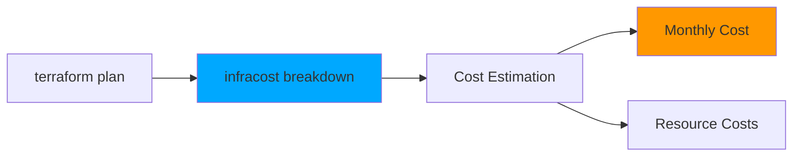

**Verwendung:**
```bash
# Kosten-Analyse für Plan
terraform plan -out=tfplan.binary
terraform show -json tfplan.binary > plan.json
infracost breakdown --path plan.json

# Kosten in CI/CD
infracost breakdown --path plan.json --format json > infracost.json
infracost comment github --path infracost.json --repo my-org/my-repo --pull-request 123

# Kosten-Diff (was ändert sich?)
infracost diff --path plan.json
```

**Beispiel-Output:**
```
Project: terraform

 Name                                    Monthly Qty  Unit   Monthly Cost 
                                                                          
 aws_instance.web                        730          hours  $65.70       
 aws_lb.application                     730          hours  $16.43       
 aws_s3_bucket.data                     1            months $0.023       
                                                                          
 OVERALL TOTAL                                                    $82.14   
─────────────────────────────────────────────────────────────────────────
```

---

### tfenv - Terraform Version Manager

**Was macht es?** Verwaltet mehrere Terraform-Versionen (wie nvm für Node.js).

```bash
# Terraform Version installieren
tfenv install 1.13.4
tfenv install latest

# Version verwenden
tfenv use 1.13.4

# Version für Projekt setzen (via .terraform-version Datei)
echo "1.13.4" > .terraform-version
tfenv use

# Verfügbare Versionen auflisten
tfenv list
```

---

## ⚙️ Ansible - Configuration Management {#ansible}

### Was ist Ansible?

**Ansible** verwaltet Server-Konfigurationen und automatisiert Tasks ohne Agents auf den Ziel-Servern.

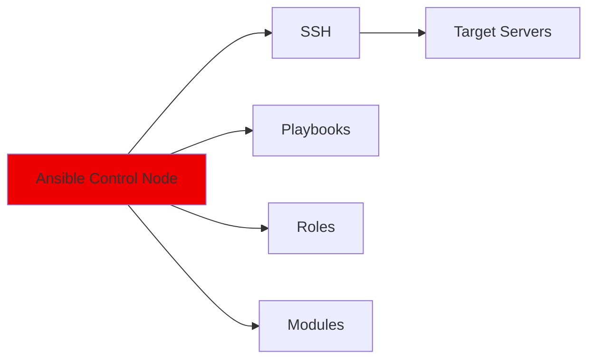

### Ansible Basics

**Workflow:**

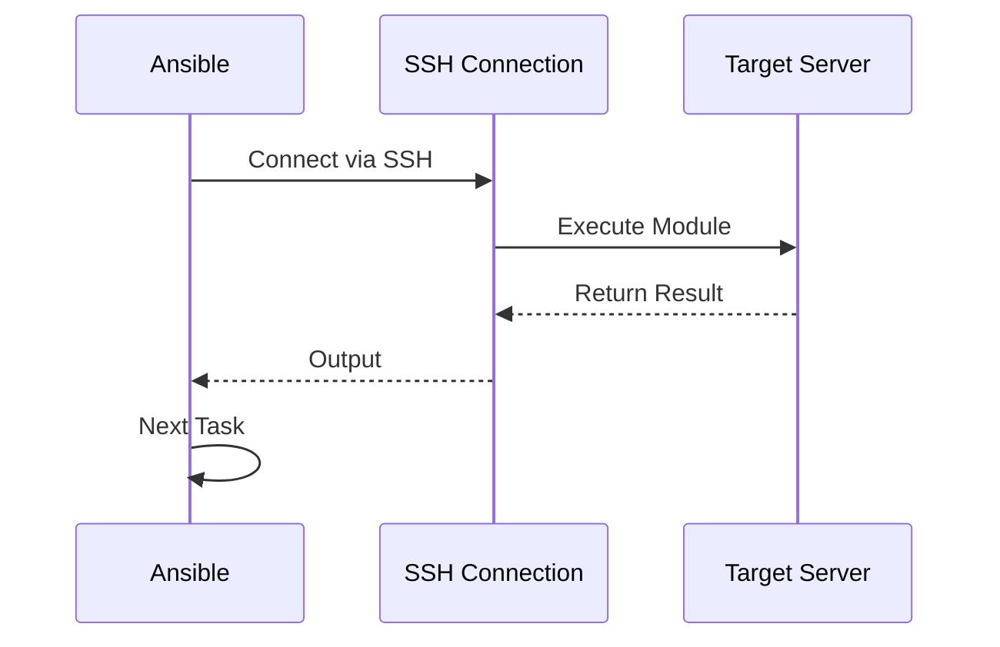

**Basis-Befehle:**
```bash
# Ad-Hoc Command
ansible all -i inventory -m ping
ansible webservers -i inventory -a "apt update"

# Playbook ausführen
ansible-playbook playbook.yml -i inventory

# Playbook mit Check-Modus (dry-run)
ansible-playbook playbook.yml --check --diff

# Specific Host
ansible-playbook playbook.yml --limit webserver1
```

### Playbook Beispiel

**`playbook.yml`:**
```yaml
---
- name: Configure Web Server
  hosts: webservers
  become: yes
  tasks:
    - name: Update apt cache
      apt:
        update_cache: yes
    
    - name: Install nginx
      apt:
        name: nginx
        state: present
    
    - name: Start nginx service
      systemd:
        name: nginx
        state: started
        enabled: yes
```

**`inventory`:**
```ini
[webservers]
web1 ansible_host=192.168.1.10
web2 ansible_host=192.168.1.11

[webservers:vars]
ansible_user=ubuntu
ansible_ssh_private_key_file=~/.ssh/id_rsa
```

---

### ansible-lint - Ansible Code Quality

**Was macht es?** Linter für Ansible Playbooks und Roles.

```bash
# Playbook linten
ansible-lint playbook.yml

# Alle YAML-Dateien
ansible-lint .

# Auto-fix
ansible-lint --fix playbook.yml

# Spezifische Rules ignorieren
ansible-lint playbook.yml -x risky-shell-pipe
```

**Typische Issues die ansible-lint findet:**
- Fehlende `name:` in Tasks
- Unsichere Shell-Befehle
- Deprecated Syntax
- Best-Practice-Verstöße

---

## ☁️ Cloud CLIs {#cloud-clis}

### AWS CLI

**Setup:**
```bash
# Konfigurieren
aws configure

# Fragen:
# - AWS Access Key ID
# - AWS Secret Access Key
# - Default Region: eu-central-1
# - Default Output: json

# S3-Bucket erstellen
aws s3 mb s3://my-bucket-name

# EC2-Instance auflisten
aws ec2 describe-instances

# EKS-Cluster konfigurieren
aws eks update-kubeconfig --name my-cluster --region eu-central-1
```

**GitOps-Integration:**
```bash
# Secrets aus AWS Secrets Manager holen
aws secretsmanager get-secret-value --secret-id my-secret

# Terraform State in S3 pushen
aws s3 cp terraform.tfstate s3://terraform-state/project.tfstate
```

---

### Azure CLI

**Setup:**
```bash
# Login
az login

# Subscription setzen
az account set --subscription "My Subscription"

# Resource Group erstellen
az group create --name my-rg --location westeurope

# AKS-Cluster konfigurieren
az aks get-credentials --resource-group my-rg --name my-cluster
```

**Häufige Befehle:**
```bash
# Resource Groups auflisten
az group list --output table

# VMs auflisten
az vm list --output table

# Storage Account erstellen
az storage account create --name mystorage --resource-group my-rg
```

---

### Google Cloud CLI (gcloud)

**Setup:**
```bash
# Login
gcloud auth login

# Projekt setzen
gcloud config set project my-project-id

# GKE-Cluster konfigurieren
gcloud container clusters get-credentials my-cluster --zone us-central1
```

**Hinweis:** gcloud wurde installiert, aber PATH muss eventuell aktualisiert werden:
```bash
# Zu ~/.bashrc hinzufügen:
export PATH="$HOME/google-cloud-sdk/bin:$PATH"
```

---

## 📦 Packer & Image Building {#packer}

### Was ist Packer?

**Packer** baut VM- und Container-Images für verschiedene Plattformen (AWS AMI, Docker, etc.).

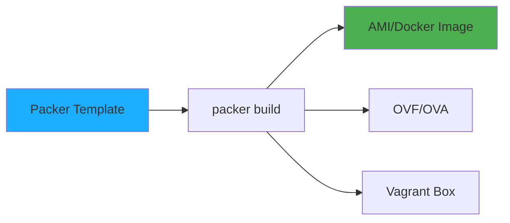

**Workflow:**

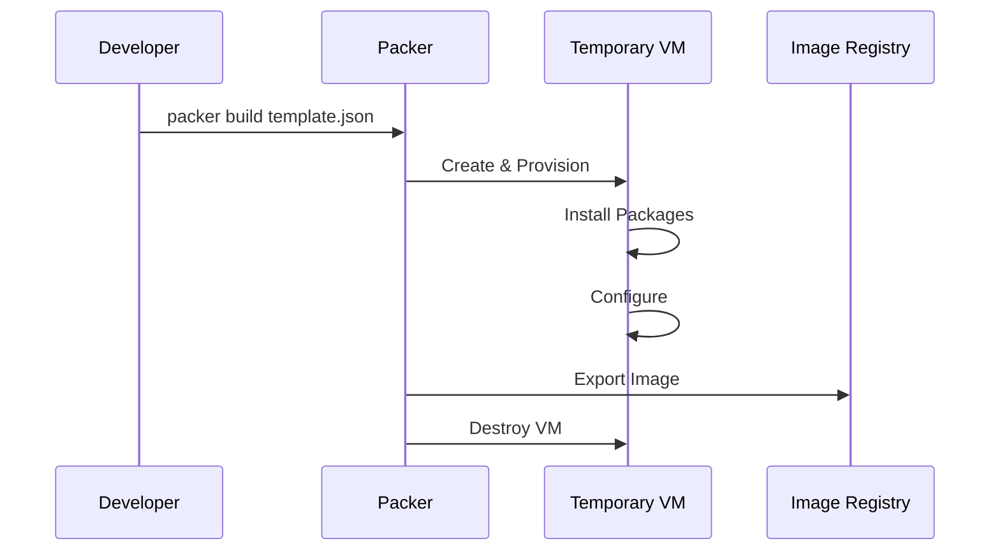

**Beispiel `aws-ami.json`:**
```json
{
  "builders": [{
    "type": "amazon-ebs",
    "region": "us-east-1",
    "source_ami": "ami-0c55b159cbfafe1f0",
    "instance_type": "t2.micro",
    "ssh_username": "ubuntu",
    "ami_name": "my-app-{{timestamp}}"
  }],
  "provisioners": [{
    "type": "shell",
    "scripts": [
      "scripts/install-nginx.sh",
      "scripts/configure-app.sh"
    ]
  }]
}
```

**Verwendung:**
```bash
# Build Image
packer build aws-ami.json

# Validate Template
packer validate aws-ami.json

# Build mit Variables
packer build -var 'region=eu-central-1' aws-ami.json
```

---

## 🔄 GitOps Workflows mit IaC {#gitops-workflows}

### Terraform + GitOps

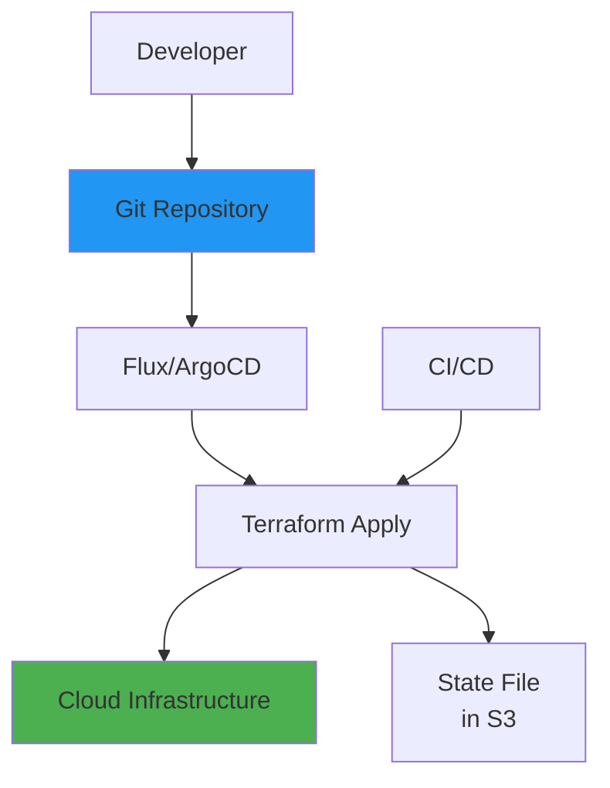

**Workflow:**
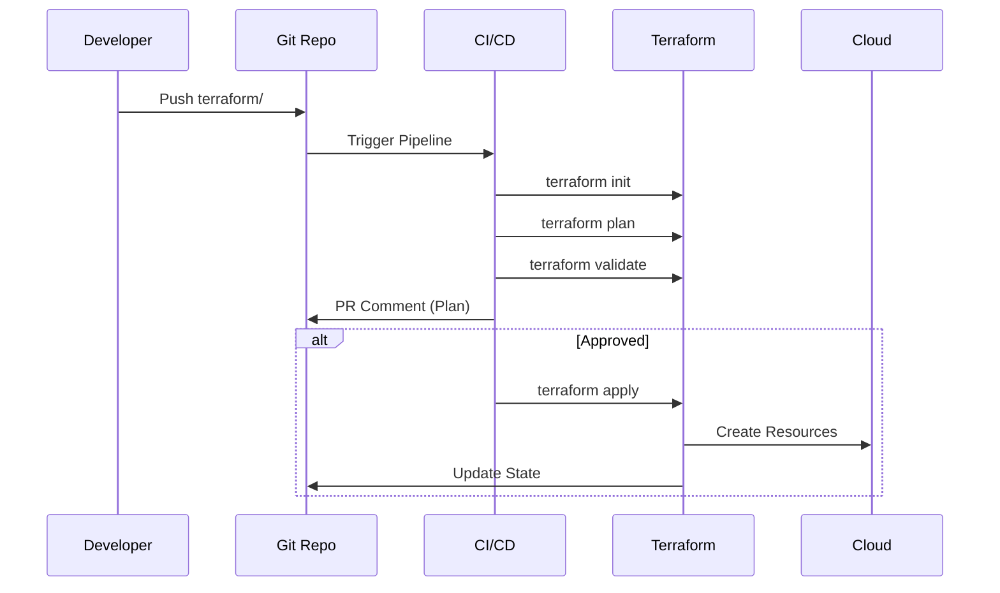

### Ansible + GitOps

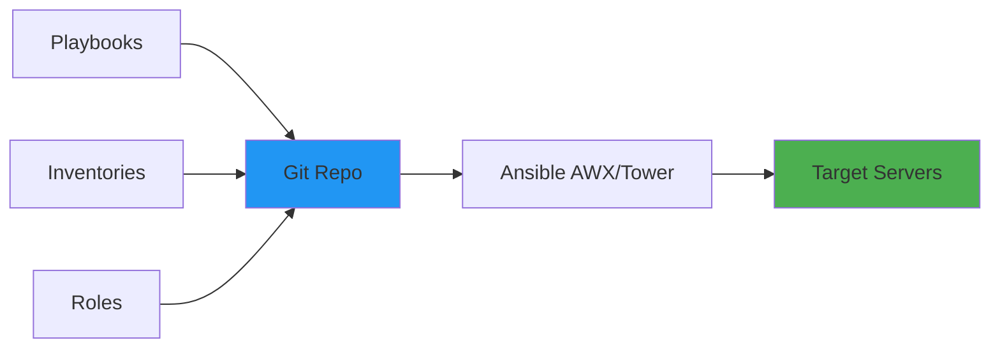

---

## ✅ Best Practices {#best-practices}

### Terraform Best Practices

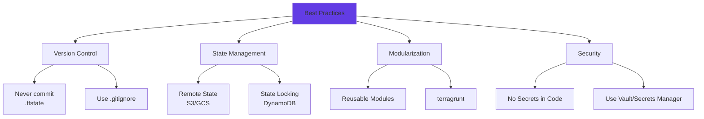

**`.gitignore` für Terraform:**
```
# State Files
*.tfstate
*.tfstate.*
.terraform/
.terraform.lock.hcl

# Variables mit Secrets
*.tfvars
!terraform.tfvars.example

# Crash Logs
crash.log
crash.*.log

# Override Files
override.tf
override.tf.json
*_override.tf
*_override.tf.json
```

**Remote State Setup (S3):**
```hcl
terraform {
  backend "s3" {
    bucket         = "my-terraform-state"
    key            = "project/terraform.tfstate"
    region         = "eu-central-1"
    encrypt        = true
    dynamodb_table = "terraform-locks"
  }
}
```

### Ansible Best Practices

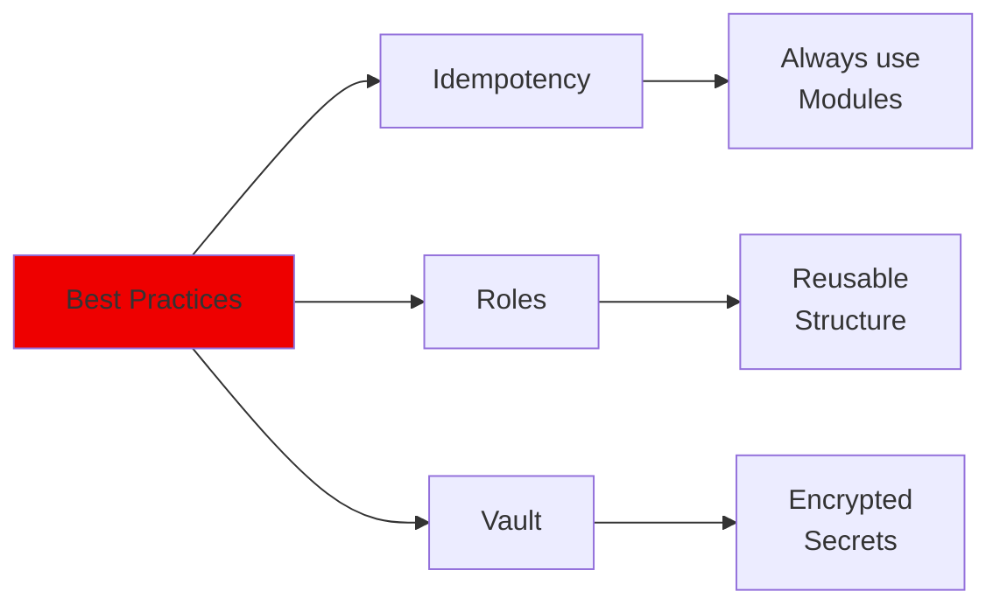

**Struktur:**
```
ansible/
├── playbooks/
│   └── deploy.yml
├── roles/
│   ├── nginx/
│   │   ├── tasks/
│   │   ├── handlers/
│   │   └── defaults/
│   └── app/
├── inventories/
│   ├── dev
│   └── prod
└── group_vars/
    └── all/
        └── secrets.yml  # Encrypted mit ansible-vault
```

**Secrets verschlüsseln:**
```bash
# Secret-Datei verschlüsseln
ansible-vault encrypt group_vars/all/secrets.yml

# Playbook mit Vault ausführen
ansible-playbook playbook.yml --ask-vault-pass

# Oder Password-File
ansible-playbook playbook.yml --vault-password-file ~/.vault_pass.txt
```

---

## 📚 Quick Reference Card {#quick-reference-card}

### Terraform Commands

| Command | Zweck |
|---------|-------|
| `terraform init` | Initialisieren & Provider laden |
| `terraform plan` | Plan erstellen |
| `terraform apply` | Änderungen anwenden |
| `terraform destroy` | Infrastruktur zerstören |
| `terraform fmt` | Code formatieren |
| `terraform validate` | Code validieren |
| `terraform state list` | State auflisten |
| `terraform output` | Outputs anzeigen |

### Ansible Commands

| Command | Zweck |
|---------|-------|
| `ansible all -m ping` | Connectivity testen |
| `ansible-playbook playbook.yml` | Playbook ausführen |
| `ansible-playbook --check` | Dry-run |
| `ansible-lint playbook.yml` | Lint Playbook |
| `ansible-vault encrypt file.yml` | Secrets verschlüsseln |

### Cloud CLI Quick Access

| Cloud | Login | Common Command |
|-------|-------|----------------|
| AWS | `aws configure` | `aws s3 ls` |
| Azure | `az login` | `az vm list` |
| GCP | `gcloud auth login` | `gcloud compute instances list` |

---

## ✅ Installation Status

| Tool | Version | Status |
|------|---------|--------|
| terraform | v1.13.4 | ✅ Installiert (via tfenv) |
| tflint | v0.59.1 | ✅ Installiert |
| terragrunt | v0.92.1 | ✅ Installiert |
| tfenv | 3.0.0 | ✅ Installiert |
| terraform-docs | v0.18.0 | ✅ Installiert |
| tfsec | v1.28.14 | ✅ Installiert (QA-Runde) |
| checkov | v3.2.489 | ✅ Installiert (via pip) |
| infracost | v0.10.42 | ✅ Installiert |
| ansible | v2.19.3 | ✅ Installiert |
| ansible-lint | v25.9.2 | ✅ Installiert |
| ansible-navigator | v25.9.0 | ✅ Installiert (~/.local/bin) |
| packer | v1.14.2 | ✅ Installiert |
| aws-cli | v2.31.24 | ✅ Installiert |
| azure-cli | v2.78.0 | ✅ Installiert |
| gcloud | latest | ⚠️ Installiert* (PATH-Setup nötig) |
| cloudflared | v2025.10.0 | ✅ Installiert |
| pulumi | v3.205.0 | ✅ Installiert (~/.pulumi/bin) |

**Hinweise:**
- **gcloud**: In `/tmp/google-cloud-sdk` installiert. PATH erweitern: `export PATH="$HOME/google-cloud-sdk/bin:$PATH"` dann `gcloud init`
- **pulumi**: In `~/.pulumi/bin` installiert. PATH erweitern: `export PATH="$HOME/.pulumi/bin:$PATH"`
- **ansible-navigator**: In `~/.local/bin`. PATH erweitern: `export PATH="$HOME/.local/bin:$PATH"`
- **terraform-docs**: ✅ Erfolgreich installiert (QA-Runde)
- **tfsec**: ✅ Installiert v1.28.14 (QA-Runde - GitHub API Recherche erfolgreich)
- **checkov**: ✅ Installiert via pip v3.2.489
- **terrascan**: Nicht installiert (Release-URLs 404). Alternative: tfsec + checkov verwenden
- **terraform-ls**: Nicht installiert. Empfehlung: VS Code Extension "Terraform" verwenden
- **vagrant**: Installiert, benötigt VirtualBox Setup für WSL2

**PATH-Setup für alle Tools:**

Füge folgendes zu `~/.bashrc` oder `~/.zshrc` hinzu:
```bash
export PATH="$HOME/.local/bin:$PATH"
export PATH="$HOME/.pulumi/bin:$PATH"
if [ -d "$HOME/google-cloud-sdk/bin" ]; then
    export PATH="$HOME/google-cloud-sdk/bin:$PATH"
fi
```

---

**Viel Erfolg mit deinem Infrastructure-as-Code Setup! ☁️**

*Diese Dokumentation wurde automatisch generiert für WSL2 Ubuntu 24.04*

