# 🚀 Kubernetes Tools Dokumentation - GitOps/DevOps Edition

**Dokumentation für Dummies** mit anschaulichen Mermaid-Visualisierungen für GitHub!

---

## 📋 Inhaltsverzeichnis

1. [Übersicht der installierten Tools](#übersicht)
2. [Core-Tools (kubectl, docker, helm)](#core-tools)
3. [Terminal UI & Navigation](#terminal-ui--navigation)
4. [Log-Management & Debugging](#log-management--debugging)
5. [Config-Management & Cleanup](#config-management--cleanup)
6. [GitOps Tools](#gitops-tools)
7. [Validation & Testing](#validation--testing)
8. [Local Development](#local-development)
9. [Workflows & Best Practices](#workflows--best-practices)

---

## 🎯 Übersicht der installierten Tools {#übersicht}


---

## 🔧 Core Tools {#core-tools}

### kubectl - Kubernetes Command Line

**Was macht es?** Die Basis-CLI für alle Kubernetes-Operationen.


**Beispiele:**
```bash
# Ressourcen auflisten
kubectl get pods
kubectl get all -n production

# Manifest anwenden
kubectl apply -f deployment.yaml

# Logs anschauen
kubectl logs -f my-pod -n production

# In Pod reinbegeben
kubectl exec -it my-pod -- /bin/bash

# Port weiterleiten (z.B. lokale DB auf Port 5432)
kubectl port-forward svc/postgres 5432:5432
```

**Praxis-Tipp für GitOps:** Nutze `kubectl get -o yaml` um die aktuelle Config aus dem Cluster zu exportieren!

---

### docker - Container Engine

**Was macht es?** Verwalte Container-Images und -Container.

```mermaid
graph TB
    A[docker] --> B[Images]
    A --> C[Containers]
    A --> D[Networks]
    A --> E[Volumes]
    
    B --> B1[build - Erstelle Image]
    B --> B2[pull - Lade Image]
    B --> B3[push - Sende Image]
    
    C --> C1[run - Starte Container]
    C --> C2[stop - Stoppe Container]
    C --> C3[logs - Zeige Logs]
    C --> C4[exec - Führe Command aus]
```



**Beispiele:**
```bash
# Image bauen
docker build -t myapp:latest .

# Container starten
docker run -d -p 8080:80 myapp:latest

# Logs anschauen
docker logs -f my-container

# In Container reinbegeben
docker exec -it my-container /bin/sh
```

---

### helm - Kubernetes Package Manager

**Was macht es?** Installiere und verwalte komplexe Kubernetes-Anwendungen mit Charts.


**Beispiele:**
```bash
# Chart installieren
helm install my-app bitnami/nginx

# Mit Custom Values
helm install my-app ./my-chart -f values.yaml

# Upgrade durchführen
helm upgrade my-app ./my-chart -f values.yaml

# Chart deinstallieren
helm uninstall my-app

# Helm Repository hinzufügen
helm repo add bitnami https://charts.bitnami.com/bitnami
helm repo update
```

**GitOps-Tipp:** Werte `helm template` um manifests für Git zu generieren, statt direkt zu installieren!

---

## 🖥️ Terminal UI & Navigation {#terminal-ui--navigation}

### k9s - Terminal UI für Kubernetes

**Was macht es?** Interaktive Terminal-UI statt ständig `kubectl` zu tippen.


**Wichtigste Shortcuts:**
- `:` + Command (z.B. `:pods`, `:deployments`)
- `l` = Logs anschauen
- `s` = Shell in Pod öffnen
- `d` = Describe Resource
- `e` = Edit Resource (YAML)
- `Ctrl+D` = Delete Resource
- `/` = Suche filtern
- `Ctrl+C` = Zurück/Beenden

**Beispiel-Workflow:**
```bash
k9s                    # k9s starten
:pods                  # Zeige alle Pods
/<pod-name>            # Filter nach Pod-Namen
Enter                  # Pod-Details
l                      # Logs anschauen
Esc                    # Zurück
s                      # Shell öffnen
```

---

### kubectx & kubens - Context & Namespace Navigation

**Was macht es?** Schnell zwischen Clustern und Namespaces wechseln.

```mermaid
graph TB
    A[kubectx - Cluster wechseln] --> A1[Liste: kubectx]
    A --> A2[Wechseln: kubectx prod-cluster]
    A --> A3[Zurück: kubectx -]
    
    B[kubens - Namespace wechseln] --> B1[Liste: kubens]
    B --> B2[Wechseln: kubens production]
    B --> B3[Zurück: kubens -]
    
    style A fill:#ff9800
    style B fill:#2196f3
```



**Beispiele:**
```bash
# Verfügbare Cluster auflisten
kubectx

# Zu Production-Cluster wechseln
kubectx prod-cluster

# Zurück zum vorherigen Cluster
kubectx -

# Aktuellen Cluster anzeigen
kubectx -c

# Verfügbare Namespaces
kubens

# Zu Production-Namespace wechseln
kubens production

# Aktuellen Namespace anzeigen
kubens -c
```

**GitOps-Praxis:** Verwende unterschiedliche Contexts für Dev/Staging/Prod und wechsle schnell zwischen ihnen!

---

## 📋 Log-Management & Debugging {#log-management--debugging}

### kubectl logs - Standard Log-Viewing

**Workflow für Log-Analyse:**


**Praktische Befehle:**
```bash
# Aktuelle Logs (letzte 100 Zeilen)
kubectl logs my-pod --tail=100

# Logs live folgen
kubectl logs -f my-pod

# Logs von Crashed Pod (vor Restart)
kubectl logs my-pod --previous

# Logs aus allen Containern im Pod
kubectl logs my-pod --all-containers=true

# Logs aus spezifischem Container
kubectl logs my-pod -c sidecar-container

# Logs mit Timestamps
kubectl logs my-pod --timestamps
```

---

### kubectl-debug - Debug Container in Pods

**Was macht es?** Öffne ein Debug-Container in laufenden Pods ohne den Pod zu modifizieren.


**Beispiele:**
```bash
# Debug Container mit netshoot (Network-Tools)
kubectl debug my-pod -it --image=nicolaka/netshoot -- sh

# Debug mit anderem Image (z.B. busybox)
kubectl debug my-pod -it --image=busybox -- sh

# Debug mit Kopie des Pods (wenn Original nicht modifizierbar)
kubectl debug my-pod -it --copy-to=my-pod-debug --image=busybox -- sh
```

**Debug-Szenarien:**
```bash
# DNS auflösen
nslookup kubernetes.default.svc.cluster.local

# Netzwerk verbindungen testen
curl http://service-name:8080

# Prozesse anschauen
ps aux

# Netzwerk-Interfaces
ip addr
```

---

## 🧹 Config-Management & Cleanup {#config-management--cleanup}

### kubectl-neat - YAML Cleanup Tool

**Was macht es?** Entfernt Default-Werte aus `kubectl get -o yaml` Output für saubere Git-Commits.

```mermaid
graph LR
    A[kubectl get pod -o yaml] --> B[Vollständiges YAML<br/>mit Defaults]
    B --> C[kubectl neat]
    C --> D[Sauberes YAML<br/>nur relevante Werte]
    
    D --> E[Git Commit]
    
    style B fill:#ffebee
    style D fill:#e8f5e9
```



**Problem gelöst:**
```yaml
# VORHER (mit kubectl get -o yaml):
apiVersion: v1
kind: Pod
metadata:
  creationTimestamp: "2025-01-15T10:30:00Z"
  managedFields: [...]
  name: my-pod
spec:
  containers:
  - image: nginx:latest
    imagePullPolicy: Always  # <- Default Wert
    resources: {}            # <- Leeres Objekt
    terminationMessagePath: /dev/termination-log  # <- Default

# NACHHER (mit kubectl neat):
apiVersion: v1
kind: Pod
metadata:
  name: my-pod
spec:
  containers:
  - image: nginx:latest
```

**Beispiele:**
```bash
# Pod-Config aufräumen
kubectl get pod my-pod -o yaml | kubectl neat > clean-pod.yaml

# Deployment-Config aufräumen
kubectl get deployment my-app -o yaml | kubectl neat > clean-deployment.yaml

# Als JSON ausgeben
kubectl get pod my-pod -o json | kubectl neat -o json

# Direkt aus Datei
kubectl neat -f messy-pod.yaml > clean-pod.yaml
```

**GitOps-Best-Practice:** Nutze `kubectl neat` bevor du Configs in Git committest!

---

## 🔄 GitOps Tools {#gitops-tools}

### Flux - GitOps Engine

**Was macht es?** Automatisiert Kubernetes-Deployments basierend auf Git-Repositories.


**Workflow:**


**Flux-Befehle:**
```bash
# Flux installieren (bereits installiert, aber zur Info)
flux install --namespace=flux-system

# Git-Repository verbinden
flux create source git my-app \
  --url=https://github.com/user/repo \
  --branch=main \
  --interval=1m

# Kustomization erstellen (was wird deployed)
flux create kustomization my-app \
  --source=my-app \
  --path="./k8s" \
  --prune=true \
  --interval=10m

# Status prüfen
flux get sources git
flux get kustomizations

# Logs anschauen
flux logs --namespace=flux-system
```

**Flux Status-Check:**
```bash
# Alle Flux Ressourcen prüfen
flux check

# Detaillierte Ausgabe
flux get all

# Troubleshooting
flux logs --follow
```

---

### ArgoCD - GitOps Continuous Delivery

**Was macht es?** UI-basiertes GitOps-Tool mit visueller Oberfläche und Rollback-Fähigkeiten.


**ArgoCD vs. Flux:**


**ArgoCD-Befehle:**
```bash
# Login zum ArgoCD Server
argocd login argocd.example.com

# Application erstellen
argocd app create my-app \
  --repo https://github.com/user/repo \
  --path k8s \
  --dest-server https://kubernetes.default.svc \
  --dest-namespace production

# Application Status
argocd app get my-app

# Application synchronisieren
argocd app sync my-app

# Application löschen
argocd app delete my-app

# Rollback durchführen
argocd app rollback my-app <revision>

# Application Logs
argocd app logs my-app
```

**Wann Flux, wann ArgoCD?**

```mermaid
graph TB
    A[GitOps Tool Auswahl] --> B{Kleinere Setups<br/>CLI bevorzugt?}
    B -->|Ja| C[Flux]
    B -->|Nein| D{UI benötigt?}
    D -->|Ja| E[ArgoCD]
    D -->|Nein| C
    
    C --> C1[✅ Lightweight]
    C --> C2[✅ Native K8s CRDs]
    C --> C3[❌ Keine UI]
    
    E --> E1[✅ Web UI]
    E --> E2[✅ Rollback GUI]
    E --> E3[❌ Mehr Overhead]
```



---

## ✅ Validation & Testing {#validation--testing}

### kubeval - Kubernetes Manifest Validation

**Was macht es?** Validiert Kubernetes YAML-Dateien gegen die Kubernetes API-Schemas.

```mermaid
graph LR
    A[YAML Datei] --> B[kubeval]
    B --> C{Syntax OK?}
    C -->|Ja| D{Schema OK?}
    C -->|Nein| E[❌ Fehler]
    D -->|Ja| F[✅ Valid]
    D -->|Nein| G[⚠️ Schema Fehler]
    
    style F fill:#4caf50
    style E fill:#f44336
    style G fill:#ff9800
```



**Beispiele:**
```bash
# Einzelne Datei validieren
kubeval deployment.yaml

# Alle YAML-Dateien in Verzeichnis
kubeval *.yaml

# Spezifische Kubernetes-Version
kubeval --kubernetes-version 1.28.0 deployment.yaml

# Strikte Validierung (auch unbekannte Felder)
kubeval --strict deployment.yaml

# Für GitOps: CI/CD Pipeline
kubeval k8s/**/*.yaml || exit 1
```

**Typische Fehler die kubeval findet:**
- Falsche API-Versionen
- Fehlende Pflichtfelder (z.B. `metadata.name`)
- Falsche Datentypen (z.B. String statt Integer)
- Unbekannte Felder (bei `--strict`)

---

## 🛠️ Local Development {#local-development}

### Tilt - Local Kubernetes Development

**Was macht es?** Entwickle und teste Kubernetes-Anwendungen lokal mit automatischen Rebuilds.

```mermaid
graph TB
    A[Code Änderung] --> B[Tilt Watch]
    B --> C[Rebuild Image]
    C --> D[Push zu Registry]
    D --> E[Redeploy Pod]
    E --> F[Live Reload]
    
    G[Tiltfile] --> B
    G --> G1[Build Config]
    G --> G2[Deploy Config]
    G --> G3[Resource Dependencies]
    
    style B fill:#ff9800
    style F fill:#4caf50
```



**Workflow:**


```mermaid
sequenceDiagram
    participant Dev as Developer
    participant Tilt as Tilt
    participant Docker as Docker Build
    participant K8s as Local K8s
    
    Dev->>Tilt: tilt up
    Tilt->>Docker: Build Image
    Tilt->>K8s: Deploy Resources
    loop Development
        Dev->>Dev: Ändere Code
        Tilt->>Tilt: Detect Change
        Tilt->>Docker: Rebuild
        Tilt->>K8s: Redeploy
        K8s-->>Dev: Änderung live!
    end
    Dev->>Tilt: tilt down
```

**Tiltfile Beispiel:**
```python
# Tiltfile
docker_build('my-app', '.')
k8s_yaml('k8s/deployment.yaml')
k8s_resource('my-app', port_forwards=8080)
```

**Befehle:**
```bash
# Tilt starten
tilt up

# In Browser öffnet sich Tilt UI
# http://localhost:10350

# Tilt stoppen
tilt down

# Status prüfen (in anderem Terminal)
tilt get uiresources
```

**Vorteile:**
- ✅ Automatische Rebuilds bei Code-Änderung
- ✅ Visuelles Dashboard
- ✅ Schnellere Development-Zyklen
- ✅ Resource-Dependencies automatisch geregelt

---

## 🎯 Workflows & Best Practices {#workflows--best-practices}

### GitOps Workflow - Komplett

```mermaid
graph TB
    A[Entwicklung] --> B[Code Änderung]
    B --> C[Commit & Push]
    C --> D[Git Repository]
    
    D --> E[Flux/ArgoCD]
    E --> F[Validate mit kubeval]
    F --> G{Kubernetes Apply}
    
    G -->|Erfolg| H[✅ Deployment OK]
    G -->|Fehler| I[❌ Rollback]
    
    I --> J[Argocd Rollback]
    I --> K[Flux Revert Commit]
    
    L[Monitoring] --> H
    L --> I
    
    style D fill:#2196f3
    style E fill:#ff9800
    style H fill:#4caf50
    style I fill:#f44336
```



### Debugging-Workflow


### Config-Export für Git


**Praktischer Command:**
```bash
# Best Practice: Export & Cleanup Workflow
kubectl get deployment my-app -o yaml | \
  kubectl neat > k8s/deployments/my-app.yaml && \
  git add k8s/deployments/my-app.yaml && \
  git commit -m "chore: update my-app deployment"
```

---

## 📚 Quick Reference Card

### Wichtigste Commands im Überblick

| Tool | Command | Zweck |
|------|---------|-------|
| **kubectl** | `kubectl get pods` | Ressourcen auflisten |
| **kubectl** | `kubectl logs -f pod-name` | Logs folgen |
| **kubectl** | `kubectl exec -it pod -- sh` | Shell in Pod |
| **k9s** | `k9s` | Terminal UI öffnen |
| **kubectx** | `kubectx prod-cluster` | Cluster wechseln |
| **kubens** | `kubens production` | Namespace wechseln |
| **kubectl-neat** | `kubectl get pod -o yaml \| kubectl neat` | YAML aufräumen |
| **flux** | `flux get kustomizations` | Flux Status prüfen |
| **argocd** | `argocd app sync my-app` | App synchronisieren |
| **kubeval** | `kubeval *.yaml` | Manifests validieren |
| **tilt** | `tilt up` | Local Dev starten |

### Keyboard Shortcuts (k9s)

| Shortcut | Aktion |
|----------|--------|
| `:` | Command Mode |
| `l` | Logs anzeigen |
| `s` | Shell öffnen |
| `d` | Describe |
| `e` | Edit YAML |
| `Ctrl+D` | Delete |
| `/` | Suche |
| `Esc` | Zurück |

---

## 🎓 Lernpfad für GitOps

```mermaid
graph TD
    A[GitOps Beginner] --> B[1. kubectl Basics]
    B --> C[2. k9s Navigation]
    C --> D[3. Config Management]
    D --> E[4. kubectl-neat]
    E --> F[5. GitOps Setup]
    F --> G[6. Flux/ArgoCD]
    G --> H[7. Validation]
    H --> I[kubeval CI/CD]
    I --> J[GitOps Master]
    
    style A fill:#e3f2fd
    style J fill:#4caf50
```

---

## 🔗 Weitere Ressourcen

- **kubectl Cheat Sheet**: https://kubernetes.io/docs/reference/kubectl/cheatsheet/
- **k9s GitHub**: https://github.com/derailed/k9s
- **Flux Documentation**: https://fluxcd.io/docs/
- **ArgoCD Documentation**: https://argo-cd.readthedocs.io/

---

## ✅ Installation Status

| Tool | Version | Status |
|------|---------|--------|
| kubectl | v1.34.1 | ✅ Installiert |
| docker | v28.5.1 | ✅ Installiert |
| helm | v3.10.2 | ✅ Installiert |
| k9s | v0.50.16 | ✅ Installiert |
| kubectx | latest | ✅ Installiert |
| kubens | latest | ✅ Installiert |
| kubectl-debug | latest | ✅ Installiert |
| kubectl-neat | v2.0.4 | ✅ Installiert |
| flux | v2.7.3 | ✅ Installiert |
| argocd | v3.1.9 | ✅ Installiert |
| kubeval | v0.16.1 | ✅ Installiert |
| tilt | v0.35.2 | ✅ Installiert |

**Optional/Troubleshooting:**
- **stern**: Installation versucht, aber Release-URLs nicht konsistent (404). Workaround: `go install github.com/stern/stern@latest` oder `kubectl logs -f` mit Labels verwenden
- **kubectl-tree**: Nicht installiert (Release-URLs 404). Alternative: Via kubectl-krew: `kubectl krew install tree` oder `kubectl get all` mit Filtern

---

**Viel Erfolg mit deinem GitOps/DevOps Setup! 🚀**

*Diese Dokumentation wurde automatisch generiert für WSL2 Ubuntu 24.04*

