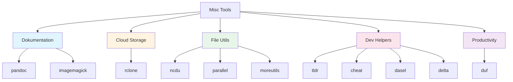

# 🎁 Misc & Nice-to-Have Tools Dokumentation - GitOps/DevOps Edition

**Nützliche Utilities für den täglichen Workflow!**

---

## 📋 Inhaltsverzeichnis

1. [Übersicht](#übersicht)
2. [Dokumentation & Konvertierung](#dokumentation--konvertierung)
3. [Cloud Storage](#cloud-storage)
4. [File & Disk Utilities](#file--disk-utilities)
5. [Development Helpers](#development-helpers)
6. [Productivity Tools](#productivity-tools)
7. [Quick Reference](#quick-reference)

---

## 🎯 Übersicht {#übersicht}



---

## 📝 Dokumentation & Konvertierung {#dokumentation--konvertierung}

### pandoc - Universal Document Converter

**Was macht es?** Konvertiert zwischen verschiedenen Dokumentformaten (Markdown, HTML, PDF, Word, etc.).

```bash
# Markdown zu HTML
pandoc README.md -o README.html

# Markdown zu PDF (benötigt LaTeX)
pandoc README.md -o README.pdf

# Markdown zu Word
pandoc README.md -o README.docx

# HTML zu Markdown
pandoc index.html -o index.md

# Mit Templates
pandoc README.md --template custom.html -o output.html

# GitOps-Beispiel: Dokumentation generieren
pandoc docs/*.md -o documentation.html
pandoc docs/*.md --toc -o documentation.pdf
```

---

### imagemagick - Image Manipulation

**Was macht es?** Bildkonvertierung und -bearbeitung aus der Kommandozeile.

```bash
# Bild konvertieren
convert image.jpg image.png

# Größe ändern
convert image.jpg -resize 800x600 resized.jpg

# Qualität anpassen
convert image.jpg -quality 85 optimized.jpg

# Mehrere Bilder konvertieren
convert *.jpg -resize 50% thumbnails/

# GitOps-Beispiel: Screenshots für Dokumentation
convert screenshot.png -resize 1200x -quality 90 docs/screenshot.png
```

---

## ☁️ Cloud Storage {#cloud-storage}

### rclone - Cloud Storage Sync Tool

**Was macht es?** Syncs Dateien zu/von Cloud-Storage-Services (S3, Google Drive, Azure, etc.).


**Setup:**
```bash
# Remote konfigurieren
rclone config

# Beispiel: S3 konfigurieren
# Type: s3
# Provider: AWS
# Access Key: YOUR_KEY
# Secret: YOUR_SECRET
```

**Verwendung:**
```bash
# Dateien hochladen
rclone copy /local/path remote:bucket/path

# Dateien synchronisieren
rclone sync /local/path remote:bucket/path

# Dateien auflisten
rclone ls remote:bucket/

# Dateien löschen
rclone delete remote:bucket/file.txt

# Verschiedene Remotes:
rclone copy /backup s3:my-backup-bucket
rclone copy /docs gdrive:documentation
rclone copy /data azure:storage-container

# GitOps-Beispiel: Configs zu S3
rclone sync k8s/ s3:my-bucket/k8s-configs/
```

---

## 💾 File & Disk Utilities {#file--disk-utilities}

### ncdu - Interactive Disk Usage Analyzer

**Was macht es?** Interaktive Disk-Usage-Analyse (wie `du`, aber visuell).

```bash
# Verzeichnis scannen
ncdu /home

# Bestimmtes Verzeichnis
ncdu /var/log

# Navigation:
# ↑↓ = Navigieren
# Enter = Eintreten
# d = Löschen
# q = Beenden

# GitOps-Beispiel: Docker-Images aufräumen
ncdu /var/lib/docker
```

---

### parallel - Parallel Command Execution

**Was macht es?** Führt Befehle parallel aus für bessere Performance.

```bash
# Mehrere Dateien gleichzeitig verarbeiten
parallel convert {} {}_thumb.jpg ::: *.jpg

# Mit mehreren Argumenten
parallel echo {1} {2} ::: A B ::: 1 2
# Output: A 1, A 2, B 1, B 2

# Git-Repos parallel updaten
parallel -j 4 git -C {} pull ::: repo1 repo2 repo3 repo4

# Kubernetes-Deployments parallel prüfen
parallel kubectl get deployment -n {} ::: namespace1 namespace2 namespace3

# GitOps-Beispiel: Terraform in mehreren Verzeichnissen
parallel terraform init ::: terraform/environments/*
parallel terraform plan ::: terraform/environments/*
```

---

### moreutils - Additional Unix Utilities

**Was macht es?** Sammlung nützlicher Utilities (sponge, ts, vidir, etc.).

**sponge** - Datei schreiben ohne Race Conditions:
```bash
# Sortiere Datei "in-place"
sort file.txt | sponge file.txt

# Mehrere Operationen
cat file.txt | grep pattern | sponge file.txt
```

**ts** - Timestamp zu Ausgabe hinzufügen:
```bash
# Logs mit Timestamps
tail -f logfile | ts '[%Y-%m-%d %H:%M:%S]'

# Command-Ausgabe timestampen
kubectl logs pod | ts
```

---

## 🔧 Development Helpers {#development-helpers}

### tldr - Simplified Man Pages

**Was macht es?** Zeigt vereinfachte Beispiele für Commands (besser als `man`).

```bash
# Command-Beispiele anzeigen
tldr kubectl
tldr docker
tldr git

# Suche
tldr -s kubernetes

# Lokalen Cache updaten
tldr --update

# GitOps-Beispiel: Quick-Reference
tldr terraform
tldr helm
tldr kubectl
```

---

### cheat - Interactive Cheat Sheets

**Was macht es?** Interaktive Cheat-Sheets für Commands.

```bash
# Cheat-Sheet anzeigen
cheat kubectl
cheat docker
cheat git

# Alle verfügbaren Sheets
cheat -l

# Suche
cheat -s kubernetes

# Eigene Sheets hinzufügen
mkdir -p ~/.config/cheat/cheatsheets
echo "# My Command\ncommand --option" > ~/.config/cheat/cheatsheets/mycommand
```

---

### dasel - Data Selector

**Was macht es?** Daten-Selektor für JSON/YAML/TOML/CSV/XML (wie jq, aber für mehr Formate).

```bash
# JSON
echo '{"name":"test"}' | dasel -p json '.name'

# YAML
dasel -p yaml '.spec.replicas' deployment.yaml

# TOML
dasel -p toml '.database.host' config.toml

# CSV
dasel -p csv -r '.name' data.csv

# Werte ändern
dasel put -p yaml -t int '.spec.replicas' -v 5 deployment.yaml

# GitOps-Beispiel: Config-Manipulation
dasel put -p yaml '.spec.replicas' -v 3 -i k8s/deployment.yaml
```

---

### delta - Git Diff Viewer

**Was macht es?** Syntax-Highlighting für Git-Diffs (besser als Standard-Diff).

```bash
# Git-Diff mit delta
git diff | delta

# Als Git-Pager konfigurieren
git config --global core.pager delta
git config --global interactive.diffFilter 'delta --color-only'

# Features:
# - Syntax-Highlighting
# - Side-by-Side View
# - Line Numbers
# - Git Blame Integration

# GitOps-Beispiel: Terraform-Changes anschauen
git diff terraform/ | delta
```

---

## 📊 Productivity Tools {#productivity-tools}

### duf - Disk Usage/Free (Better df)

**Was macht es?** Moderneres `df` mit besserer Darstellung.

```bash
# Disk-Usage anzeigen
duf

# Spezifische Mountpoints
duf /home /var

# JSON-Output
duf --json

# Sortieren
duf --sort size

# GitOps-Beispiel: System-Ressourcen prüfen
duf
```

---

## 📚 Quick Reference {#quick-reference}

### Dokumentation

| Tool | Command | Zweck |
|------|---------|-------|
| **pandoc** | `pandoc input.md -o output.html` | Dokumente konvertieren |
| **imagemagick** | `convert image.jpg image.png` | Bilder konvertieren |

### Cloud Storage

| Tool | Command | Zweck |
|------|---------|-------|
| **rclone** | `rclone sync /local remote:path` | Cloud-Sync |

### File Utilities

| Tool | Command | Zweck |
|------|---------|-------|
| **ncdu** | `ncdu /path` | Disk-Usage analysieren |
| **parallel** | `parallel cmd ::: args` | Parallele Ausführung |
| **sponge** | `cmd | sponge file` | Datei schreiben |

### Dev Helpers

| Tool | Command | Zweck |
|------|---------|-------|
| **tldr** | `tldr kubectl` | Command-Beispiele |
| **cheat** | `cheat git` | Cheat-Sheets |
| **dasel** | `dasel -p yaml '.field' file` | Daten selektieren |
| **delta** | `git diff | delta` | Git-Diff Viewer |

### Productivity

| Tool | Command | Zweck |
|------|---------|-------|
| **duf** | `duf` | Disk-Usage anzeigen |

---

## ✅ Installation Status

| Tool | Version | Status |
|------|---------|--------|
| pandoc | v3.1.3 | ✅ Installiert |
| imagemagick | v6.9.12 | ✅ Installiert |
| rclone | v1.66.0 | ✅ Installiert |
| ncdu | v1.19 | ✅ Installiert |
| parallel | v20231122 | ✅ Installiert |
| moreutils | v0.69 | ✅ Installiert |
| tldr | v0.9.2 | ✅ Installiert |
| cheat | v4.4.0 | ✅ Installiert |
| dasel | v2.6.0 | ✅ Installiert |
| delta | v0.17.0 | ✅ Installiert |
| duf | v0.8.1 | ✅ Installiert |
| procs | - | ⚠️ Nicht installiert* |
| dust | - | ⚠️ Nicht installiert* |

**Hinweise:**
- **procs, dust**: Nicht installiert (Release-URLs 404). Alternativen: `ps` und `du` verwenden

---

## 🎯 Setup-Empfehlungen

### Git-Delta konfigurieren

```bash
# Zu ~/.gitconfig hinzufügen
[core]
    pager = delta

[interactive]
    diffFilter = delta --color-only

[delta]
    syntax-theme = Dracula
    side-by-side = true
```

### tldr Cache updaten

```bash
# Regelmäßig Cache updaten
tldr --update
```

---

**Viel Erfolg mit deinen Misc Tools! 🎁**

*Diese Dokumentation wurde automatisch generiert für WSL2 Ubuntu 24.04*

