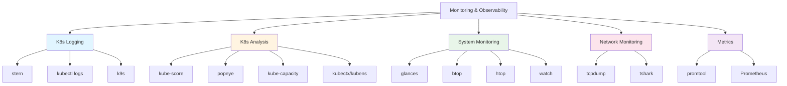
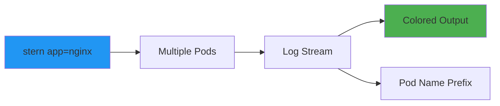
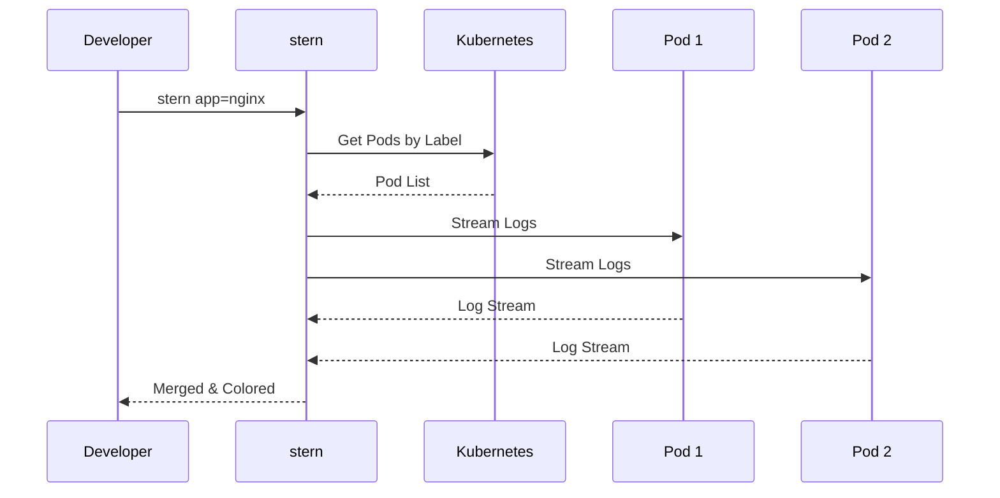
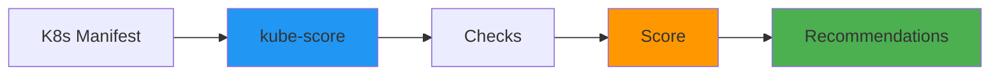
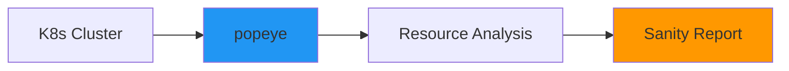
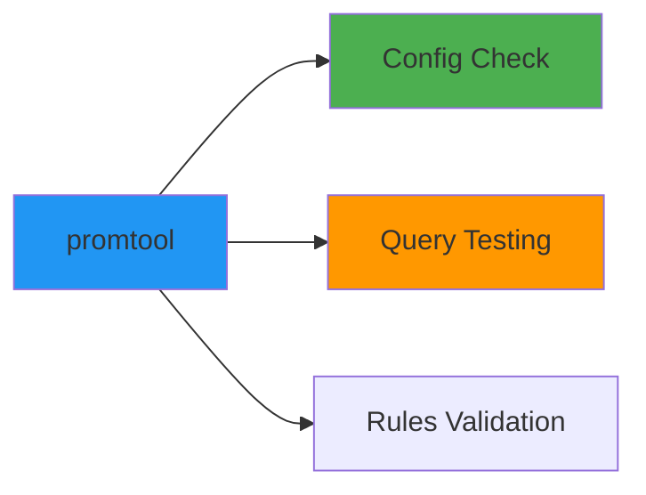
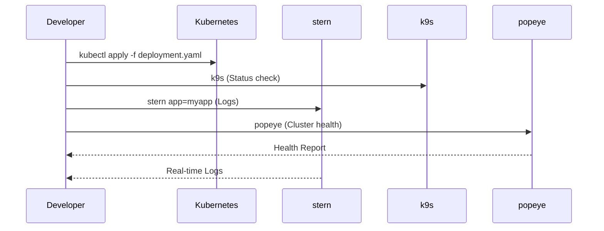
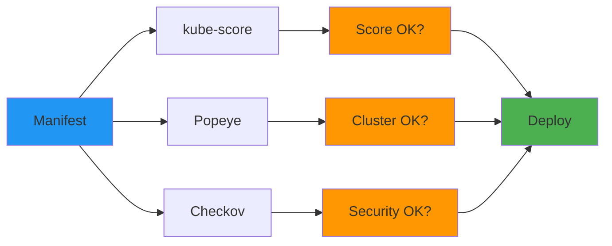

# 📊 Monitoring & Observability Tools Dokumentation - GitOps/DevOps Edition

**Dokumentation für Dummies** mit anschaulichen Mermaid-Visualisierungen für GitHub!

---

## 📋 Inhaltsverzeichnis

1. [Übersicht der installierten Tools](#übersicht)
2. [Kubernetes Logging & Monitoring](#kubernetes-logging--monitoring)
3. [Kubernetes Cluster Analysis](#kubernetes-cluster-analysis)
4. [System Monitoring](#system-monitoring)
5. [Network Monitoring](#network-monitoring)
6. [Metrics & Prometheus](#metrics--prometheus)
7. [GitOps Monitoring Workflows](#gitops-monitoring-workflows)
8. [Quick Reference Card](#quick-reference-card)

---

## 🎯 Übersicht der installierten Tools {#übersicht}



---

## ☸️ Kubernetes Logging & Monitoring {#kubernetes-logging--monitoring}

### stern - Multi-Pod Log Tailer

**Was macht es?** Streamt Logs von mehreren Pods gleichzeitig mit Farb-Coding.



**Grundlegende Verwendung:**
```bash
# Alle Pods mit Label scannen
stern app=nginx

# Bestimmter Namespace
stern -n production app=nginx

# Mehrere Labels
stern app=nginx,version=1.0

# Regex-Pattern
stern "^nginx-.*"

# Mit Timestamps
stern --timestamps app=nginx

# Nur bestimmte Container
stern -c nginx-container app=nginx

# Exclude bestimmte Pods
stern app=nginx --exclude busybox

# Exit bei Fehler
stern --since 10s app=nginx | grep -i error

# GitOps-Beispiel: Alle Pods eines Deployments
stern -l app=myapp,component=api
```

**Workflow:**



**Erweiterte Features:**
```bash
# Logs seit bestimmter Zeit
stern --since 1h app=nginx

# Nur neue Logs (follow mode ist default)
stern --since 1m app=nginx

# JSON-Output
stern --output json app=nginx

# Template für Output
stern --template '{{.ContainerName}}[{{.PodName}}]: {{.Message}}' app=nginx

# Kombiniert mit anderen Tools
stern app=nginx | grep ERROR | head -20
```

---

### kubectl logs - Native Logging

**Was macht es?** Standard Kubernetes Log-Tooling.

```bash
# Pod-Logs
kubectl logs my-pod

# Alle Container in Pod
kubectl logs my-pod --all-containers=true

# Logs folgen (streaming)
kubectl logs -f my-pod

# Seit bestimmter Zeit
kubectl logs --since=1h my-pod

# Letzte N Zeilen
kubectl logs --tail=100 my-pod

# Mehrere Pods (mit stern besser)
kubectl logs -l app=nginx

# GitOps-Beispiel: Deployment-Logs
kubectl logs -l app=myapp --tail=100
```

---

### k9s - Kubernetes TUI

**Was macht es?** Terminal UI für Kubernetes (bereits installiert).

```bash
# k9s starten
k9s

# Mit Namespace
k9s -n production

# Mit Context
k9s --context my-context

# Shortcuts in k9s:
# :pods - Pods anzeigen
# :svc - Services anzeigen
# :logs - Logs anzeigen (drücke l auf Pod)
# /pattern - Suchen
```

---

## 🔍 Kubernetes Cluster Analysis {#kubernetes-cluster-analysis}

### kube-score - Manifest Scoring

**Was macht es?** Analysiert Kubernetes-Manifests und gibt einen Score für Best Practices.



**Verwendung:**
```bash
# Manifest scannen
kube-score score deployment.yaml

# Mehrere Dateien
kube-score score k8s/*.yaml

# Nur kritische Issues
kube-score score --ignore-test-container-image-pull-policy deployment.yaml

# Exit-Code bei Problemen
kube-score score --exit-one-on-warning deployment.yaml

# JSON-Output
kube-score score --output-format json deployment.yaml > report.json

# GitOps-Beispiel: Pre-Commit Hook
kube-score score k8s/*.yaml || exit 1
```

**Typische Checks:**
- ✅ Resource Requests/Limits gesetzt?
- ✅ Liveness/Readiness Probes vorhanden?
- ✅ Container Image Tags gepinnt?
- ✅ Security Context gesetzt?
- ✅ Service Type angemessen?

---

### popeye - Cluster Sanitizer

**Was macht es?** Scanned live Kubernetes-Cluster auf Probleme und gibt Report.



**Verwendung:**
```bash
# Cluster scan
popeye

# Spezifischer Namespace
popeye -n production

# Spezifischer Context
popeye --context my-cluster

# Output in Datei
popeye --out popeye-report.html

# Nur bestimmte Ressourcen
popeye -s deployments,services

# Exit-Code bei Issues
popeye --min-score 80 || exit 1

# GitOps-Beispiel: CI/CD Check
popeye --out report.html --min-score 70
```

**Popeye prüft:**
- Resource Quotas
- Pod Disruption Budgets
- Network Policies
- RBAC Issues
- Deprecated APIs
- Unused Resources

---

### kube-capacity - Resource Capacity Analysis

**Was macht es?** Zeigt Resource-Usage und Capacity im Cluster.

```bash
# Resource Overview
kube-capacity

# Mit Pod-Details
kube-capacity --pods

# Mit Container-Details
kube-capacity --containers

# Resource Utilization anzeigen
kube-capacity --util

# Nach Namespace filtern
kube-capacity -n production

# JSON-Output
kube-capacity --output json

# YAML-Output
kube-capacity --output yaml

# GitOps-Beispiel: Capacity Planning
kube-capacity --util --pods > capacity-report.json
```

**Output zeigt:**
- Node CPU/Memory Requests/Limits
- Node Capacity
- Used vs. Available
- Resource Utilization Prozent

---

### kubectx & kubens - Context/Namespace Switching

**Was macht es?** Schnelles Wechseln zwischen Kubernetes-Contexts und Namespaces.

```bash
# Context wechseln
kubectx

# Zu bestimmtem Context
kubectx production-cluster

# Zurück zum vorherigen
kubectx -

# Context umbenennen
kubectx production-cluster=prod

# Namespace wechseln
kubens

# Zu bestimmtem Namespace
kubens production

# Aktuellen Namespace anzeigen
kubens -c

# GitOps-Workflow
kubectx prod-cluster
kubens production
kubectl get pods
```

**Aliases für mehr Komfort:**
```bash
# Zu ~/.bashrc hinzufügen
alias kx='kubectx'
alias kn='kubens'
```

---

## 💻 System Monitoring {#system-monitoring}

### glances - System Overview

**Was macht es?** Umfassende System-Übersicht mit vielen Metriken (bereits installiert).

```bash
# glances starten
glances

# Web-Interface
glances -w

# Remote-Monitoring
glances -s  # Server-Modus
glances -c server-ip  # Client-Modus

# Nur bestimmte Plugins
glances --enable-plugin docker,network
```

---

### btop - Modernes System-Monitoring

**Was macht es?** Visuelles System-Monitoring mit besseren Grafiken (bereits installiert).

```bash
# btop starten
btop

# Tree-View für Prozesse
btop -t
```

---

### htop - Interaktiver Prozess-Viewer

**Was macht es?** Bessere Alternative zu `top` (bereits installiert).

```bash
# htop starten
htop

# Prozess nach Namen filtern (F4)
# Prozess killen (F9)
```

---

### watch - Kommandos wiederholt ausführen

**Was macht es?** Führt Befehl regelmäßig aus und aktualisiert Display (bereits installiert).

```bash
# Kubernetes Pods alle 2 Sekunden
watch kubectl get pods

# Mit Intervall (z.B. 5 Sekunden)
watch -n 5 kubectl get pods

# Mit Highlighting von Änderungen
watch -d kubectl get pods

# GitOps-Beispiel: Deployment-Status
watch kubectl get deployment,service,pods
```

---

## 🌐 Network Monitoring {#network-monitoring}

### tcpdump - Network Packet Analyzer

**Was macht es?** Erfasst und analysiert Netzwerk-Pakete.

```bash
# Alle Pakete auf Interface
sudo tcpdump -i eth0

# Filter nach Host
sudo tcpdump host example.com

# Filter nach Port
sudo tcpdump port 80

# TCP-Pakete
sudo tcpdump tcp

# Mit mehr Details
sudo tcpdump -v

# In Datei speichern
sudo tcpdump -w capture.pcap

# Aus Datei lesen
tcpdump -r capture.pcap

# GitOps-Beispiel: Kubernetes Service Traffic
sudo tcpdump -i any port 8080
```

---

### tshark - Wireshark CLI

**Was macht es?** Network Protocol Analyzer (CLI-Version von Wireshark).

```bash
# Pakete erfassen (benötigt sudo)
sudo tshark -i eth0

# Filter anwenden
sudo tshark -i eth0 -f "port 80"

# In Datei speichern
sudo tshark -i eth0 -w capture.pcap

# Aus Datei analysieren
tshark -r capture.pcap

# Bestimmte Felder anzeigen
tshark -r capture.pcap -T fields -e ip.src -e ip.dst

# HTTP-Requests filtern
tshark -r capture.pcap -Y http.request

# GitOps-Beispiel: Kubernetes API Traffic
sudo tshark -i any -f "host kubernetes.default.svc"
```

---

## 📈 Metrics & Prometheus {#metrics--prometheus}

### promtool - Prometheus Tooling

**Was macht es?** Utility-Tools für Prometheus (Config-Checking, Queries, etc.).



**Prometheus Config prüfen:**
```bash
# Config validieren
promtool check config prometheus.yml

# Rules validieren
promtool check rules rules.yml

# Unit-Tests für Rules
promtool test rules test.yml

# PromQL-Query testen
promtool query instant 'up{job="prometheus"}'

# Range-Query
promtool query range --start=2024-01-01T00:00:00Z --end=2024-01-01T23:59:59Z 'rate(up[5m])'
```

**GitOps-Beispiel:**
```bash
# Pre-Deploy Check
promtool check config prometheus-config.yaml || exit 1
promtool check rules alert-rules.yaml || exit 1
```

---

## 🔄 GitOps Monitoring Workflows {#gitops-monitoring-workflows}

### Deployment Monitoring Workflow



**Praxis-Workflow:**
```bash
# 1. Deployment ausrollen
kubectl apply -f k8s/deployment.yaml

# 2. Status prüfen
kubectl rollout status deployment/myapp

# 3. Logs streamen
stern -l app=myapp --since 5m

# 4. Resource-Usage prüfen
kube-capacity --util

# 5. Cluster-Gesundheit
popeye
```

---

### Pre-Deploy Validation Workflow



**CI/CD Integration:**
```bash
#!/bin/bash
# Pre-Deploy Validation Script

# 1. Manifest-Scoring
kube-score score k8s/*.yaml || exit 1

# 2. Security-Scan
checkov -d k8s/ --framework kubernetes || exit 1

# 3. Deploy
kubectl apply -f k8s/

# 4. Cluster-Health
popeye --min-score 80 || exit 1

# 5. Watch Deployment
watch kubectl get pods -l app=myapp
```

---

### Incident Response Workflow

```bash
# 1. Problem identifizieren
kubectl get pods | grep Error

# 2. Pod-Logs prüfen
stern -l app=myapp --since 10m | grep -i error

# 3. Resource-Usage prüfen
kube-capacity --util --pods

# 4. Cluster-Status
popeye

# 5. Network-Issues
tcpdump -i any port 8080

# 6. Context/Namespace wechseln falls nötig
kubectx prod-cluster
kubens production
```

---

## 📚 Best Practices {#best-practices}

### Logging Best Practices

1. **Structured Logging verwenden**
   ```yaml
   # In Deployment
   env:
     - name: LOG_FORMAT
       value: "json"
   ```

2. **Log-Level richtig setzen**
   - DEBUG: Development
   - INFO: Production Default
   - WARN: Warnings
   - ERROR: Errors

3. **Log-Aggregation**
   - EFK Stack (Elasticsearch, Fluentd, Kibana)
   - Loki + Grafana
   - Cloud-native: CloudWatch, Stackdriver

### Monitoring Best Practices

1. **Health Checks implementieren**
   - Liveness Probes
   - Readiness Probes
   - Startup Probes

2. **Metrics sammeln**
   - Prometheus + Grafana
   - Custom Metrics
   - Business Metrics

3. **Alerts konfigurieren**
   - PagerDuty, Alertmanager
   - Slack, Email Notifications

---

## 📚 Quick Reference Card {#quick-reference-card}

### Kubernetes Monitoring

| Tool | Command | Zweck |
|------|---------|-------|
| **stern** | `stern app=nginx` | Multi-Pod Logs |
| **kubectl logs** | `kubectl logs pod` | Single-Pod Logs |
| **k9s** | `k9s` | TUI für K8s |
| **kube-score** | `kube-score score file.yaml` | Manifest Scoring |
| **popeye** | `popeye` | Cluster Health |
| **kube-capacity** | `kube-capacity --util` | Resource Usage |
| **kubectx** | `kubectx prod` | Context wechseln |
| **kubens** | `kubens prod` | Namespace wechseln |

### System Monitoring

| Tool | Command | Zweck |
|------|---------|-------|
| **glances** | `glances` | System Overview |
| **btop** | `btop` | Modernes Monitoring |
| **htop** | `htop` | Prozess-Viewer |
| **watch** | `watch kubectl get pods` | Periodische Ausführung |

### Network Monitoring

| Tool | Command | Zweck |
|------|---------|-------|
| **tcpdump** | `tcpdump -i eth0` | Packet Capture |
| **tshark** | `tshark -i eth0` | Protocol Analyzer |

### Metrics

| Tool | Command | Zweck |
|------|---------|-------|
| **promtool** | `promtool check config` | Prometheus Tools |

---

## ✅ Installation Status

| Tool | Version | Status |
|------|---------|--------|
| stern | v1.32.0 | ✅ Installiert |
| kube-score | v1.18.0 | ✅ Installiert |
| kube-capacity | v0.7.2 | ✅ Installiert |
| popeye | v0.11.1 | ✅ Installiert |
| promtool | v2.48.0 | ✅ Installiert |
| tcpdump | v4.99.4 | ✅ Installiert |
| tshark | v4.2.2 | ✅ Installiert |
| kubectx | latest | ✅ Installiert |
| kubens | latest | ✅ Installiert |
| glances | v3.4.0.3 | ✅ Installiert |
| btop | v1.3.0 | ✅ Installiert |
| htop | v3.3.0 | ✅ Installiert |
| watch | latest | ✅ Installiert |
| kail | v0.17.4 | ✅ Installiert (QA-Runde) |
| kubectl-tree | - | ⚠️ Nicht installiert* |

**Hinweise:**
- **kubectl-tree**: Benötigt `kubectl krew install tree`. Alternative: `kubectl get --all-namespaces` verwenden
- Alle anderen Tools erfolgreich installiert und verfügbar

---

## 🎯 Setup-Empfehlungen

### Aliases für bessere Workflows

```bash
# Zu ~/.bashrc hinzufügen
alias ks='kubectl'
alias kx='kubectx'
alias kn='kubens'
alias k9='k9s'
alias logs='stern'
```

### Pre-Deploy Validation Script

```bash
#!/bin/bash
# validate-k8s.sh
set -e

echo "🔍 Validating Kubernetes manifests..."

# Score check
kube-score score k8s/*.yaml

# Security check
checkov -d k8s/ --framework kubernetes

echo "✅ Validation passed!"
```

---

**Viel Erfolg mit deinem Monitoring & Observability Setup! 📊**

*Diese Dokumentation wurde automatisch generiert für WSL2 Ubuntu 24.04*

