# 🔐 Security & Secrets-Management Tools Dokumentation - GitOps/DevOps Edition

**Dokumentation für Dummies** mit anschaulichen Mermaid-Visualisierungen für GitHub!

---

## 📋 Inhaltsverzeichnis

1. [Übersicht der installierten Tools](#übersicht)
2. [Secrets-Management](#secrets-management)
3. [Security-Scanning](#security-scanning)
4. [Kubernetes-Security](#kubernetes-security)
5. [Network-Security](#network-security)
6. [GitOps Security Workflows](#gitops-security-workflows)
7. [Best Practices](#best-practices)
8. [Quick Reference Card](#quick-reference-card)

---

## 🎯 Übersicht der installierten Tools {#übersicht}


---

## 🔑 Secrets-Management {#secrets-management}

### HashiCorp Vault CLI

**Was macht es?** Zentrales Secrets-Management für Passwörter, API-Keys, Zertifikate.


**Setup:**
```bash
# Vault Server (lokal für Tests)
vault server -dev

# In neuem Terminal: Vault CLI konfigurieren
export VAULT_ADDR='http://127.0.0.1:8200'
export VAULT_TOKEN='dev-root-token'  # Nur für Dev!
```

**Grundlegende Commands:**
```bash
# Status prüfen
vault status

# Secrets lesen
vault kv get secret/myapp

# Secrets schreiben
vault kv put secret/myapp username=admin password=secret123

# Liste alle Secrets
vault kv list secret/

# Secrets löschen
vault kv delete secret/myapp

# AWS Secrets Engine aktivieren
vault secrets enable aws

# Kubernetes Auth aktivieren
vault auth enable kubernetes
```

**GitOps-Beispiel:**
```bash
# Secrets für Kubernetes aus Vault holen
vault kv get -format=json secret/k8s/prod | jq -r '.data.data.password'

# In Kubernetes Secret speichern
kubectl create secret generic mysecret \
  --from-literal=password=$(vault kv get -field=password secret/k8s/prod)
```

**Workflow:**


---

### Age - Simple Encryption

**Was macht es?** Einfaches Verschlüsselungstool (moderner als GPG für viele Fälle).


**Setup:**
```bash
# Key generieren
age-keygen -o ~/.age-key.txt

# Public Key anzeigen (zum Teilen)
age-keygen -y ~/.age-key.txt
```

**Verwendung:**
```bash
# Datei verschlüsseln
age -e -r $(age-keygen -y ~/.age-key.txt) secrets.yaml > secrets.yaml.age

# Datei entschlüsseln
age -d -i ~/.age-key.txt secrets.yaml.age > secrets.yaml

# Mit Public Key verschlüsseln
echo "secret123" | age -e -r age1xxxxxxxxx > encrypted.txt

# Entschlüsseln
age -d -i ~/.age-key.txt encrypted.txt
```

**GitOps-Beispiel:**
```bash
# Kubernetes Secrets verschlüsselt speichern
kubectl get secret mysecret -o yaml | age -e -r $(cat team-keys.txt) > secret.encrypted

# In CI/CD entschlüsseln
age -d -i ~/.age-key.txt secret.encrypted | kubectl apply -f -
```

---

### SOPS - Secrets OPerationS

**Was macht es?** Verschlüsselt YAML/JSON/ENV-Dateien, bleibt git-friendly.

```mermaid
graph LR
    A[secrets.yaml] --> B[sops -e]
    B --> C[secrets.enc.yaml]
    C --> D[Git Commit ✅]
    C --> E[sops -d]
    E --> F[secrets.yaml]
    
    style B fill:#2196f3
    style D fill:#4caf50
```



**Status:** ⚠️ Nicht installiert (Release-URLs 404). **Workaround:** Via Docker oder manuelle Installation.

**Workaround mit Docker:**
```bash
# Datei verschlüsseln
docker run --rm -v $(pwd):/work -w /work mozilla/sops -e -i secrets.yaml

# Datei entschlüsseln
docker run --rm -v $(pwd):/work -w /work mozilla/sops -d secrets.yaml
```

**Installation (wenn URL verfügbar):**
```bash
curl -fsSL https://github.com/mozilla/sops/releases/download/v3.8.3/sops-v3.8.3.linux -o /tmp/sops
sudo mv /tmp/sops /usr/local/bin/sops && sudo chmod +x /usr/local/bin/sops
```

**Verwendung (wenn installiert):**
```bash
# .sops.yaml erstellen (für KMS/Key-Management)
cat > .sops.yaml <<EOF
creation_rules:
  - path_regex: secrets/.*
    kms: 'arn:aws:kms:region:account:key/key-id'
    # Oder age:
    age: age1xxxxxxxxx
EOF

# Datei verschlüsseln
sops -e -i secrets.yaml

# Datei bearbeiten (automatisch verschlüsselt)
sops secrets.yaml

# Entschlüsseln
sops -d secrets.yaml

# GitOps: Encrypted Secrets committen
git add secrets.yaml  # Verschlüsselt!
git commit -m "Add encrypted secrets"
```

---

### GPG - GNU Privacy Guard

**Was macht es?** Verschlüsselung, Signierung und Verifikation von Daten.

```bash
# Key generieren
gpg --full-generate-key

# Key auflisten
gpg --list-keys

# Datei verschlüsseln
gpg -e -r recipient@email.com file.txt

# Datei entschlüsseln
gpg -d file.txt.gpg

# Signieren
gpg --sign file.txt

# Verifizieren
gpg --verify file.txt.asc

# Git Commits signieren
git config --global user.signingkey YOUR_KEY_ID
git config --global commit.gpgsign true
```

---

## 🔍 Security-Scanning {#security-scanning}

### Trivy - Comprehensive Scanner

**Was macht es?** Scannt Container-Images, Dateisysteme, Git-Repos auf Schwachstellen.


**Container-Images scannen:**
```bash
# Image scannen
trivy image nginx:latest

# Mit Report
trivy image -f json -o report.json nginx:latest

# Nur High/Critical
trivy image --severity HIGH,CRITICAL nginx:latest

# Exit-Code bei Findings
trivy image --exit-code 1 nginx:latest
```

**Filesystem scannen:**
```bash
# Lokales Verzeichnis
trivy fs .

# Mit IAC-Scanning
trivy fs --security-checks config .

# GitOps-Beispiel: K8s Manifests
trivy fs --security-checks config,secret k8s/
```

**Git-Repository scannen:**
```bash
# Repo scannen
trivy repo https://github.com/user/repo

# Mit Branch
trivy repo --branch main https://github.com/user/repo
```

**CI/CD Integration:**
```yaml
# GitLab CI Beispiel
scan:
  script:
    - trivy image --exit-code 1 --severity HIGH,CRITICAL $CI_REGISTRY_IMAGE:$CI_COMMIT_SHA
    - trivy fs --security-checks config .
```

---

### Checkov - IaC Security Scanner

**Was macht es?** Scanned Infrastructure-as-Code (Terraform, CloudFormation, Kubernetes, etc.) auf Sicherheitsprobleme.


**Terraform scannen:**
```bash
# Terraform-Directory scannen
checkov -d terraform/

# Nur bestimmte Checks
checkov -d terraform/ --check CKV_AWS_20,CKV_AWS_21

# Mit Config-File
checkov -d terraform/ --config-file .checkov.yml

# Report im JSON-Format
checkov -d terraform/ -o json > report.json
```

**Kubernetes scannen:**
```bash
# K8s Manifests
checkov -d k8s/

# Live-K8s-Cluster
checkov -k --framework kubernetes

# Mit Kubeconfig
checkov -k --framework kubernetes --kubeconfig ~/.kube/config
```

**Dockerfile scannen:**
```bash
checkov -d . --dockerfile Dockerfile
```

**Cloud-Provider:**
```bash
# AWS CloudFormation
checkov -d cloudformation/ --framework cloudformation

# Azure ARM Templates
checkov -d arm/ --framework arm

# GCP Deployment Manager
checkov -d gcp/ --framework google_deployment_manager
```

**GitOps-Workflow:**
```bash
# Pre-Commit Hook
checkov -d . --soft-fail --framework terraform kubernetes dockerfile

# CI/CD Pipeline
checkov -d . --framework terraform --output junitxml > checkov-report.xml
```

---

### Hadolint - Dockerfile Linter

**Was macht es?** Analysiert Dockerfiles auf Best Practices und Fehler.

```bash
# Dockerfile prüfen
hadolint Dockerfile

# Mit Output-Format
hadolint --format json Dockerfile

# Alle Dockerfiles im Projekt
find . -name Dockerfile -exec hadolint {} \;

# Ignoriere bestimmte Rules
hadolint --ignore DL3008 Dockerfile

# GitOps-Beispiel
hadolint Dockerfile || exit 1
```

**Wichtige Checks:**
- `DL3008`: Warnung: Pin versions in apt get
- `DL3009`: Warnung: Delete the apt-get lists after installing
- `DL3015`: Warnung: Avoid additional packages by using `--no-install-recommends`

---

### Gitleaks - Secrets Detection

**Was macht es?** Scannt Git-Repositories auf geleakte Secrets (API-Keys, Passwörter, etc.).


**Verwendung:**
```bash
# Lokales Repo scannen
gitleaks detect --source . --verbose

# Bestimmter Branch
gitleaks detect --source . --branch main

# Mit Report
gitleaks detect --source . --report gitleaks-report.json

# Exit-Code bei Leaks
gitleaks detect --source . --exit-code 1

# Pre-Commit Hook installieren
gitleaks protect --install

# Remote Repo scannen
gitleaks detect --repo-url https://github.com/user/repo

# GitOps-Workflow
gitleaks detect --source . || exit 1
```

**Typische Detektions-Patterns:**
- AWS Access Keys
- API Keys (GitHub, GitLab, etc.)
- Passwörter
- Private Keys
- Tokens (OAuth, JWT, etc.)

---

### Git-Secrets - AWS Secrets Detection

**Was macht es?** Verhindert, dass AWS Secrets in Git commits gelangen.

```bash
# Repository initialisieren
git secrets --install

# AWS-Key-Pattern hinzufügen
git secrets --register-aws

# Andere Patterns hinzufügen
git secrets --add 'password.*=.*[0-9a-zA-Z]{20}'

# Pre-Commit Hook testen
git secrets --scan

# Bestehende Commits scannen
git secrets --scan-history

# GitOps-Workflow
git secrets --install
git secrets --register-aws
```

---

## ☸️ Kubernetes-Security {#kubernetes-security}

### Polaris - K8s Best Practices

**Was macht es?** Überprüft Kubernetes-Manifests auf Best Practices und Sicherheitsprobleme.


**Manifests scannen:**
```bash
# Lokale YAML-Dateien
polaris audit --files-path k8s/

# Mit Score-Limit
polaris audit --files-path k8s/ --set-exit-code-on-danger

# Dashboard starten (Web-UI)
polaris dashboard

# Live-Cluster auditieren
polaris audit --audit-path . --only-show-failed-tests
```

**Typische Checks:**
- Resource Requests/Limits gesetzt?
- Liveness/Readiness Probes vorhanden?
- Nicht als root laufen?
- Image Tags gepinnt?
- NetworkPolicies definiert?

**GitOps-Beispiel:**
```bash
# In CI/CD Pipeline
polaris audit --files-path k8s/ --set-exit-code-on-danger || exit 1
```

---

### Kubeaudit - K8s Security Audit

**Was macht es?** Auditiert Kubernetes-Cluster auf Sicherheitsprobleme.

**Status:** ⚠️ Nicht installiert (Release-URLs 404). **Workaround:** Via Docker.

**Workaround mit Docker:**
```bash
# Cluster auditieren
docker run --rm -v $HOME/.kube/config:/root/.kube/config \
  aquasec/kubeaudit:latest all
```

**Installation (wenn URL verfügbar):**
```bash
# Warte auf verfügbare Release-URL
curl -fsSL https://github.com/aquasecurity/kubeaudit/releases/download/v0.23.X/kubeaudit_VERSION_linux_amd64.tar.gz
```

**Verwendung (wenn installiert):**
```bash
# Alle Checks
kubeaudit all

# Spezifischer Check
kubeaudit runasnonroot

# Live-Cluster
kubeaudit all --kubeconfig ~/.kube/config

# Manifest-Dateien
kubeaudit all --manifest k8s/deployment.yaml

# Mit Auto-Fix
kubeaudit autofix -f k8s/deployment.yaml
```

**Wichtige Checks:**
- Non-root containers
- Read-only root filesystem
- CPU/Memory limits
- Drop all capabilities
- No privileged containers

---

## 🌐 Network-Security {#network-security}

### SSLScan - SSL/TLS Scanner

**Was macht es?** Testet SSL/TLS-Services auf unterstützte Cipher-Suites und Protokolle.

```bash
# Server scannen
sslscan example.com

# Mit Port
sslscan --port=443 example.com

# Nur TLS 1.2+
sslscan --tls12 example.com

# JSON-Output
sslscan --json example.com > sslscan.json

# GitOps-Beispiel: Kubernetes Service
sslscan my-service.default.svc.cluster.local
```

---

### Nmap - Network Scanner

**Was macht es?** Erkennt Hosts, offene Ports und Dienste in Netzwerken.

```bash
# Einzelnen Host scannen
nmap example.com

# Port-Range
nmap -p 80,443,8080 example.com

# Aggressiver Scan
nmap -A example.com

# OS Detection
nmap -O example.com

# Script-Scanning
nmap -sC example.com

# GitOps-Beispiel: Kubernetes Service
nmap -p 443 my-service.default.svc.cluster.local
```

---

### Step-CLI - Zero-Trust/CA Tool

**Was macht es?** Verwaltet Zertifikate und implementiert Zero-Trust-Sicherheitsmodelle.

```bash
# Certificate Authority erstellen
step ca init

# Certificate generieren
step certificate create example.com example.com.crt example.com.key

# Certificate verifizieren
step certificate verify example.com.crt --roots root.crt

# OAuth2/JWT Tokens
step oauth --auth https://accounts.example.com
```

---

## 🔄 GitOps Security Workflows {#gitops-security-workflows}

### Pre-Commit Security Workflow

```mermaid
sequenceDiagram
    participant Dev as Developer
    participant Git as Git
    participant Gitleaks as Gitleaks
    participant Checkov as Checkov
    participant Trivy as Trivy
    participant Polaris as Polaris
    
    Dev->>Git: git commit
    Git->>Gitleaks: Scan for secrets
    Gitleaks-->>Dev: ✅ No leaks
    Git->>Checkov: Scan IaC
    Checkov-->>Dev: ✅ Passed
    Git->>Trivy: Scan images
    Trivy-->>Dev: ✅ No critical CVEs
    Git->>Polaris: Audit K8s
    Polaris-->>Dev: ✅ Score OK
    Git->>Git: Commit successful
    
    alt Security Issue Found
        Gitleaks-->>Dev: ❌ Secret detected
        Git->>Dev: Commit aborted
    end
```



**Setup:**
```bash
# Pre-Commit Hooks installieren
pre-commit install

# .pre-commit-config.yaml erstellen
cat > .pre-commit-config.yaml <<EOF
repos:
  - repo: https://github.com/gitleaks/gitleaks
    rev: v8.22.0
    hooks:
      - id: gitleaks
  - repo: https://github.com/bridgecrewio/checkov
    rev: 3.2.489
    hooks:
      - id: checkov
EOF
```

---

### CI/CD Security Pipeline


**GitHub Actions Beispiel:**
```yaml
name: Security Scan

on: [push, pull_request]

jobs:
  security:
    runs-on: ubuntu-latest
    steps:
      - uses: actions/checkout@v3
      
      - name: Run Gitleaks
        uses: gitleaks/gitleaks-action@v2
        
      - name: Run Checkov
        run: checkov -d . --framework terraform kubernetes
        
      - name: Run Trivy
        run: |
          trivy fs --security-checks config .
          trivy image --exit-code 1 --severity HIGH,CRITICAL ${{ env.IMAGE }}
          
      - name: Run Polaris
        run: polaris audit --files-path k8s/ --set-exit-code-on-danger
```

---

## 📚 Best Practices {#best-practices}

### Secrets Management

1. **Nie Secrets in Git committen**
   ```bash
   # .gitignore
   *.secret
   *.key
   .env
   secrets/
   ```

2. **Verschlüsselte Secrets verwenden**
   - SOPS oder Age für verschlüsselte Secrets in Git
   - Vault für zentrale Secrets-Verwaltung

3. **Rotation von Secrets**
   ```bash
   # Regelmäßige Rotation
   vault kv put secret/myapp password=$(generate-password)
   ```

### Security Scanning

1. **Regelmäßige Scans in CI/CD**
2. **Automated Alerts bei Critical Findings**
3. **Fix-Orientierte Reports** (nicht nur finden, sondern auch fixen)

### Kubernetes Security

1. **Least Privilege** (minimale Rechte)
2. **Network Policies** (Traffic-Limiter)
3. **Resource Limits** (CPU/Memory)
4. **Non-root Containers**
5. **Read-only Root Filesystem**

---

## 📚 Quick Reference Card {#quick-reference-card}

### Secrets-Management

| Tool | Command | Zweck |
|------|---------|-------|
| **vault** | `vault kv get secret/app` | Secrets lesen |
| **age** | `age -e -r key secret.txt` | Verschlüsseln |
| **sops** | `sops -e secrets.yaml` | Secrets verschlüsseln |
| **gpg** | `gpg -e file.txt` | GPG-Verschlüsselung |

### Security Scanning

| Tool | Command | Zweck |
|------|---------|-------|
| **trivy** | `trivy image nginx:latest` | Image scannen |
| **checkov** | `checkov -d terraform/` | IaC scannen |
| **hadolint** | `hadolint Dockerfile` | Dockerfile prüfen |
| **gitleaks** | `gitleaks detect .` | Secrets in Git finden |
| **git-secrets** | `git secrets --scan` | AWS-Secrets verhindern |

### Kubernetes Security

| Tool | Command | Zweck |
|------|---------|-------|
| **polaris** | `polaris audit k8s/` | K8s Best Practices |
| **kubeaudit** | `kubeaudit all` | K8s Security Audit |

### Network Security

| Tool | Command | Zweck |
|------|---------|-------|
| **sslscan** | `sslscan example.com` | SSL/TLS testen |
| **nmap** | `nmap example.com` | Network scan |
| **step** | `step ca init` | Zertifikate verwalten |

---

## ✅ Installation Status

| Tool | Version | Status |
|------|---------|--------|
| Vault CLI | v1.21.0 | ✅ Installiert |
| Age | v1.1.1 | ✅ Installiert |
| SOPS | - | ⚠️ Nicht installiert* |
| GPG | v2.4.4 | ✅ Installiert |
| Trivy | v0.54.0 | ✅ Installiert |
| Checkov | v3.2.489 | ✅ Installiert |
| Hadolint | v2.12.0 | ✅ Installiert |
| Gitleaks | v8.22.0 | ✅ Installiert |
| Git-Secrets | latest | ✅ Installiert |
| Polaris | v9.1.0 | ✅ Installiert |
| Kubeaudit | - | ⚠️ Nicht installiert* |
| SSLScan | v2.1.2 | ✅ Installiert |
| Nmap | v7.94 | ✅ Installiert |
| Step-CLI | v0.27.1 | ✅ Installiert |

**Hinweise:**
- **SOPS**: Nicht installiert (Release-URLs 404). Workaround: Via Docker (`docker run mozilla/sops`)
- **Kubeaudit**: Nicht installiert (Release-URLs 404). Workaround: Via Docker (`docker run aquasec/kubeaudit`)
- **Checkov**: Installiert via pip in `~/.local/bin`. PATH erweitern: `export PATH="$HOME/.local/bin:$PATH"`

---

## 🎯 Setup-Empfehlungen

### Pre-Commit Hooks

```bash
# .pre-commit-config.yaml
repos:
  - repo: https://github.com/gitleaks/gitleaks
    rev: v8.22.0
    hooks:
      - id: gitleaks

# Installieren
pre-commit install
```

### CI/CD Integration

```yaml
# .github/workflows/security.yml
name: Security Scan
on: [push]
jobs:
  security:
    runs-on: ubuntu-latest
    steps:
      - uses: actions/checkout@v3
      - name: Run security scans
        run: |
          gitleaks detect --source .
          checkov -d .
          trivy fs .
```

---

**Viel Erfolg mit deinen Security-Tools! 🔐**

*Diese Dokumentation wurde automatisch generiert für WSL2 Ubuntu 24.04*

